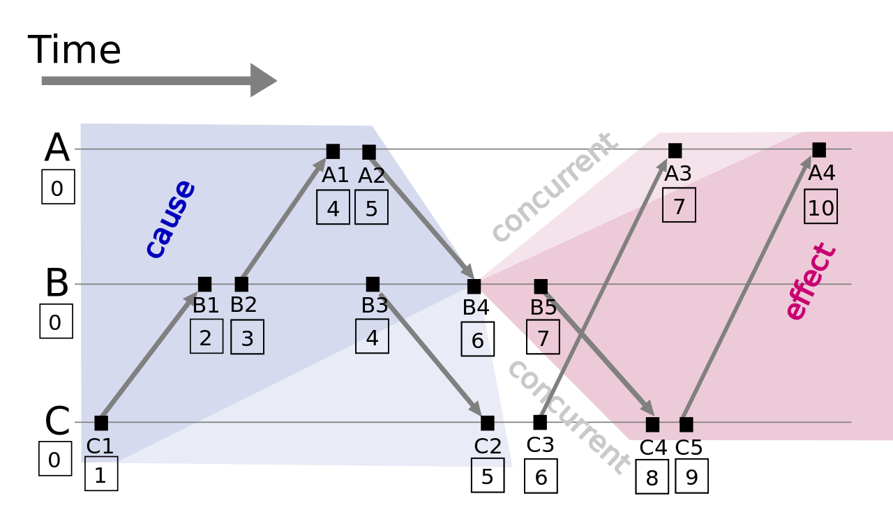
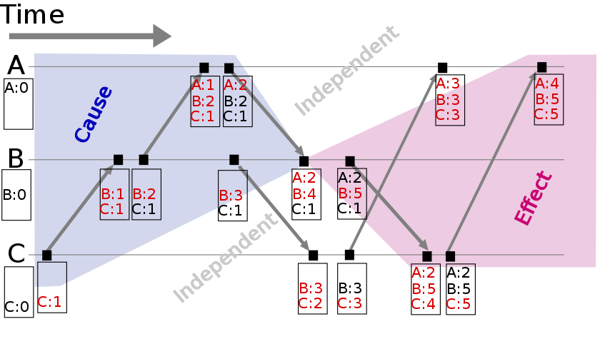
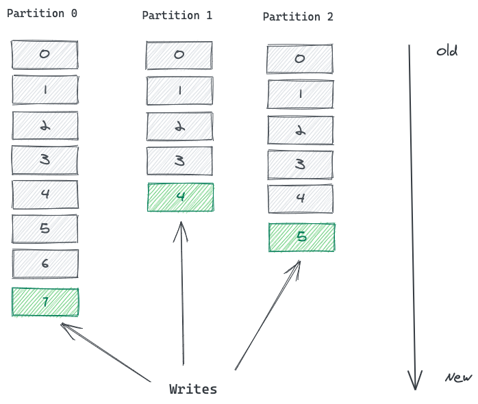

# Patterns

## Clock-Bound Wait
> Wait to cover the uncertainty in time across cluster nodes before reading and writing values so values can correctly ordered across cluster nodes

### Problem


## Gossip Dissemination
> Use random selection of nodes to pass on information to ensure it reaches all the nodes in the cluster without flooding the network

### Problem
In a cluster of nodes, each node needs to pass metadata information it has, to all the other nodes in the cluster, without depending on a shared storage. In a large cluster, if all servers communicate with all the other servers, a lot of network bandwidth can be consumed. Information should reach all the nodes even when some network links are experiencing issues

### Solution

## [Single Socket Channel](https://martinfowler.com/articles/patterns-of-distributed-systems/single-socket-channel.html)
> Maintain order of the requests sent to a server by using a single TCP connection

### Problem
When we are using Leader and Followers, we need to ensure that messages between the leader and each follower are kept in order, with a retry mechanism for any lost messages. We need to do this while keeping the cost of new connections low, so that opening a new connection doesn't increase the system's latency

### Solution
Fortunately, the long-used and widely available TCP mechanism provides all these characteristics. Thus we can get the communication we need by ensuring all communication between a follower and its leader goes through a single socket channel. The follower then serilizes the updates from leader using a Singular Update Queue

[Single Socket Channel](./drawio/single-socket-channel.drawio){link-type="drawio"}


## [Request Pipeline](https://martinfowler.com/articles/patterns-of-distributed-systems/request-pipeline.html)
> Improve latency by sending multiple requests on the connection without waiting for the response of the previous requests

### Problem
Communicating between servers within a cluster using Single Socket Channel can cause performance issues if requests need to wait for responses for previous requests to be returned. To achieve better throughput and latency, the request queue on the server should be filled enough to make sure server capacity is fully utilized. For example, when Singular Update Queue is used within a server, it can always accept more requests until the queue fills up, while it's processing a request. If only one request is sent at a time, most of the server capacity is unneccessarily wasted

### Solution
Nodes send requests to other nodes without waiting for responses from previous requests. This is achieved by creating two separate threads, one for sending requests over a network channel and one for receiving response from the network channel

[Request Pipeline](./drawio/request-pipeline.drawio){link-type="drawio"}

## [Request Batch](https://martinfowler.com/articles/patterns-of-distributed-systems/request-batch.html)
> Combine multiple requests to optimally utilize the network

### Problem
When requests are sent to cluster nodes, if a lot of requests are sent with a small amount of data, network latency and the request processing time(including serialization, deserialization of the request on the server side) can add significant overhead

### Solution
Combine multiple requests together into a single request batch. The batch of the request will be sent to the cluster node for processing with each request processed in exactly the same manner as an individual request. It will then respond with the batch of the responses

There're two checks which are generally done:
+ If enough requests have accumulated to fill the batch to the maximum configured size
+ Because we can not wait forever for the batch to be filled in, we can configure a small amount of wait time. The sender task waits and then checks if the request has been added before the maximum wait time

[Request Batch](./drawio/request-batch.drawio){link-type="drawio"}

## [Request Waiting List](https://martinfowler.com/articles/patterns-of-distributed-systems/request-waiting-list.html)
> Track client requests which require responses after the criteria to respond is met based on responses from other cluster nodes

### Problem
The cluster node receivers and processes responses from multiple other cluster nodes asynchronously. It then needs to correlate them to check if the Quorum for a particular client request is reached


### Solution
The cluster node maintains a waiting list which maps a key and a callback function. The key is chosen depending on the specific criteria to invoke the callback. The callback handles the response and decides if the client request can be fulfilled

[request waiting list](./drawio/request-waiting-list.drawio){link-type="drawio"}

> Sometimes responses from the other cluster nodes are delayed. In these instances the waiting list generally has a mechanism to expire requests after a timeout


## Idempotent Receiver
> Identify requests from clients uniquely so they can ignore duplicate requests when client retries

### Problem
Clients send requests to servers but might not get a response. It's impossible for clients to know if the response was lost or the server crashed before processing the request. To make sure that the request is processed, the client has to re-send the request

If the server had already processed the request and crashed after that servers will get duplicate requests from clients, when the client retries


::: tip At-most once, At-least once and Exactly Once actions

Depending on how the client interacts with the server, the guarantee of whether the server will do certain action is predetermined. If a client experiences a failure after the request is sent, and before receiving the response, there can be 3 possibilities:

[Non-Idempotent Receiver](./drawio/non-idempotent-receivers.drawio){link-type="drawio"}

1. If the client doesn't retry the request in case of failure, the server might have processed the request, or might have failed before processing the request. So the request is processed at the most once on the server
1. If the client retries the request, and the server had processed it before communication failure, it might process it again. So the request is processed at least once, but can be processed multiple times on the server
1. With idempotent receiver, even with multiple clients retries, the server processes the request only once. So to achieve exactly once actions, it's important to have idempotent receivers

:::

### Solution
Identify a client uniquely by assigning a unique id to each client


[Idempotent Receiver](./drawio/idempotent-receivers.drawio){link-type="drawio"}

## Singular Update Queue
> Use a single thread to process requests asynchronously to maintain order without blocking the caller

### Problem
When the state needs to be updated by multiple concurrent clients, we need it to be safely updated with one at a time changes. Consider the example of the Write-Ahead Log patttern. We need to entries to be processed one at a time, even if several concurrent clients are trying to write. Generally locks are used to protect against concurrent modifications. But if the tasks being performed are time consuming, like writing to a file, blocking all the other threads until the task is completed can have severe impact on overall system throughput and latency. It's important to make effective use of compute resources, while still maintaining the guarantee of one at a time execution

### Solution
Implement a workqueue and a single thread working off the queue. Multiple concurrent clients can submit state changes to the queue. But a single thread works on state changes. This can be naturally implemented with goroutines and channels in languages like golang


[Singular Update Queue](./drawio/singular-update-queue.drawio){link-type="drawio"}

```go
func (s *server) putKv(w http.ResponseWriter, r *http.Request)  {
  kv, err := s.readRequest(r, w)
  if err != nil {
    log.Panic(err)
    return
  }

  request := &requestResponse{
    request:         kv,
    responseChannel: make(chan string),
  }

  s.requestChannel <- request
  response := s.waitForResponse(request)
  w.Write([]byte(response))
}
```

```go
func (s* server) Start() error {
  go s.serveHttp()

  go s.singularUpdateQueue()

  return nil
}

func (s *server) singularUpdateQueue() {
  for {
    select {
    case e := <-s.requestChannel:
      s.updateState(e)
      e.responseChannel <- buildResponse(e);
    }
  }
}
```

## State Watch
> Notify clients when specific values change on the server
### Problem
Clients are interested in changes to the specific values on the server. It's difficult for clients to structure their logic if they need to poll the server continuously to look for changes. If clients open too many connections to the server for watching changes, it can overwhelm the server
### Solution
Allow clients to register their interest with the server for specific state changes. The server notifies the interested clients when state changes happen. The client maintains a Single Socket Channel with server. The server sends state change notifications on this channel. Clients might be interested in multiple values, but maintaining a connection per watch can overwhelm the server. Sot clients can use Request Pipeline

## [Lamport Clock](https://martinfowler.com/articles/patterns-of-distributed-systems/lamport-clock.html)
> Use logical timestamps as a version for a value to allow ordering of values across servers

### Problem
When values are stored across multiple servers, there needs to be a way to know which values were stored before the other. The system timestamp can not be used, because wall clocks are not monotonic and clock values from two different servers should not be compared(As there's no upper bound on clock drift across servers, it's impossible to compare timestamps on two different servers)

### Solution

The Lamport clock algorithm is a simple logical clock algorithm used to determine the order of events in a distributed computer system. The algorithm follows three simple rules:
1. A process increments its counter before each local event(e.g., message sending event)
1. When a process send a message, it includes its counter value with the message after executing step 1
1. On receiving a message, the counter of the recipient is updated, if necessary, to the greater of its current counter and the timestamp in the received message. The counter is then incremented by 1 before the message is considered received

```
# Sending
## event is known
time = time + 1
## event happens
send(msg, time)

# Receiving
(msg, timestamp) = receive()
time = max(timestamp, time) + 1
```

Lamport Clock maintains a single number to represent timestamp as following:
```java
class LamportClock {
    int latestTime;

    public LamportClock(int timestamp) {
        latestTime = timestamp;
    }

    public int tick(int requestTime) {
        latestTime = Integer.max(latestTime, requestTime);
        latestTime++;
        return latestTime;
    }    
```
Whenever a server carries out any write operation, it should advance the Lamport Clock, using the `tick()` method

This way, the server can be sure that write is sequenced after the request and after any other action the server has carried out since the request was initiated by the client. The server returns the timestamp that was used for writing the value to the client。 The requesting client then uses this timestamp to issue any further writes to other set of servers. This way, the causal chain of requests is maintained

::: tip Causality, Time and Happens-Before
When an event A in a system happens before another event B, it might have a causal relationship. Causal relationship means that A might have some role in causing B. This 'A happens before B' relationship is established by attaching a timestamp to each event. If A happens before B, the timestamp attached to A will be lower than the timestamp attached to B. But because we can not rely on system time, we need some way to make sure that the happens-before relationship is maintained for the timestamp attached to the events

[Paper](https://lamport.azurewebsites.net/pubs/time-clocks.pdf)
:::

A [version vector](https://en.wikipedia.org/wiki/Vector_clock) is a data structure used for determining the partial ordering of events in a distributed system and detecting causality violations



## [Hybrid Clock](https://martinfowler.com/articles/patterns-of-distributed-systems/hybrid-clock.html)
> Use a combination of system timestamp and logical timestamp to have versions as date-time, which can be ordered
### Problem
When Lamport Clock is used as a version in Versioned Value, clients do not know the actual date-time when the particular versions are stored. It's useful for clients to access versions using date-time like 2022-01-01 instead of using integers like 1, 2, 3

### Solution
[Hybrid Logical Clock](https://cse.buffalo.edu/tech-reports/2014-04.pdf) provides a way to have a version which is monotonically increasing just like a simple integer, but also has relation with the actual date time


## [Versioned Value](https://martinfowler.com/articles/patterns-of-distributed-systems/versioned-value.html)
> Store every update to a value with a new version, to allow reading historical values

### Problem
In a distributed system, nodes need to be able to tell which value for a key is the most recent. Sometimes they need to know past values so they can react properly to changes in a value

### Solution
[Versioned Value](./drawio/versioned-value.drawio){link-type="drawio"}

Store a version number with each value. The version number is incremented for every update. This allows every update to be converted to new write without blocking a read. Clients can read historical values at a specific version number

Databases use Versioned Value to implement mvcc and trasaction-isolation(Snapshot Isolation)

## [Generation Clock](https://martinfowler.com/articles/patterns-of-distributed-systems/generation.html)
> A monotonically increasing number indicating the generatiion of ther server, aka: Term, Epoch, and Generation

### Problem
In Leader and Followers setup, there's a possibility of the leader being temporarily disconnected from the followers. There might be a garbage collection pause in the leader process, or a temporary network disruption which disconnects the leader from the follower. In this case the leader process is still running, and after the pause or the network disruption is over, it will try sending replication requests to the followers. This is dangerous, as meanwhile the rest of the cluster might have selected a new leader and accepted requests from the client. It's important for the rest of the cluster to detect any requests from the old leader. The old leader itself should also be able to detect that it was temporarily disconnected from the cluster and take necessary corrective action to step down from leadership

### Solution
Maintain a monotonically increasing number indicating the generation of the server. Every time a new leader election happens, it should be marked by increasing the generation. The generation needs to be available beyond a server reboot, so it's stored with every entry in the Write-Ahead Log. As discussed in High-Water Mark, followers use this information to find conflicting entries in their log

[Generation Clock](./drawio/generation-clock.drawio){link-type="drawio"}

## [Follower Reads](https://martinfowler.com/articles/patterns-of-distributed-systems/follower-reads.html)
> Serve read requests from followers to achieve better throughput and lower latency

### Problem
When using the Leader and Followers pattern, it's possible that the leader may get overloaded if too many requests are sent to it. Furthermore in a multi-datacenter setup, where the client is in a remote datacenter, requests to the leader will be subject to additional latency

### Solution
While the write requests need to go to the leader to maintain consistency, the read-only requests can instead go to the nearest follower

[Follower Reads](./drawio/follower-reads.drawio){link-type="drawio"}


## [Leader and Followers](https://martinfowler.com/articles/patterns-of-distributed-systems/leader-follower.html)
> Have a single server to coordinate replication across a set of servers

### Problem
To achieve fault tolerance in systems which manage data, the data needs to be replicated on multiple servers

It's also important to give some guarantee about consistency to clients. When data is updated on multiple servers, a decision about when to make it visible to clients is required. Write and read Quorum is not sufficient, as some failure scenarios can cause clients to see data inconsistently. Each individual server doesn't know about the state of data on the other servers in the quorum. It's only when data is read from multiple servers, the inconsistencies can be resolved. In some cases this's not enough. Stronger guarantees are needed about the data that is sent to the clients

### Solution

Select one server amongst the cluster as leader. The leader is responsible for taking decisions on behalf of the entire cluster and propagating the decisions to all the other servers.

Every server at startup looks for an existing leader. If no leader is found, it triggers a leader election. The servers accept requests only after a leader is selected successfully. Only the leader handles the client requests. If a request is sent to a follower server, the follower can forward it to the leader server

## [Quorum](https://martinfowler.com/articles/patterns-of-distributed-systems/quorum.html)
> Avoid two groups of servers making independent decisions, by requiring majority for taking every decisions

### Problem
In a distributed system, whenever a server takes any action, it needs to ensure that in the event of a crash the results of the actions are available to the clients. This can be achieved by replicating the result to other servers in the cluster. But that leads to the question: how many other servers need to confirm the replication before the original server can be confident that the update is fully recognized. If the original server waits for too many replications, then it will respond slowly - reducing liveness(Liveness is the property of the system which says the system always makes progress). But if it doesn't have enough replications, then the update could be lost - a failure of safety(Safety is the property which says that the system is always in the correct state). It's critical to balance between the overall system performance and system continuity


### Solution
A cluster agrees that it's received an update when a majority of the nodes in the cluster have acknowledged the update. We call this number a quorum. For a cluster of *n* nodes, the quorum is *n/2+1*. The need for a quorum indicates how many failures can be tolerated - which is the size of the cluster minus the quorum. In general if we want to tolerate *f* failures we need a cluster size of *2f+1*


## [Write-Ahead Log](https://martinfowler.com/articles/patterns-of-distributed-systems/wal.html)
> Provide durability guarantee without the storage data structrues to be flushed to disk, by persisting every state change as a command to the append only log, aka ***Commit Log***

### Problem

Storing durability guarantee is needed even in the case of the server machine storing data failing. Once a server agrees to perform an action, it should do so even if it fails and restarts losing all of its in-memory state

### Solution

[Write-Ahead Log](./drawio/write-ahead-log.drawio){link-type="drawio"}


## [Heartbeat](https://martinfowler.com/articles/patterns-of-distributed-systems/heartbeat.html)
> Show a server is available by periodically sending a message to all the other servers
### Problem
When multiple servers form a cluster, the servers are responsible for storing some portion of the data, based on the partitioning and replication schemes used. Timely detection of server failures is important to make sure corrective actions can be taken by making some other server responsible for handling requests for the data on failed servers

### Solution
[Heartbeat](./drawio/heartbeat.drawio){link-type="drawio"}

## [High-Water Mark](https://martinfowler.com/articles/patterns-of-distributed-systems/high-watermark.html)
> An index in the write-ahead log showing the last successful replication, aka Commit Index

### Problem
The Write-Ahead Log pattern is used to recover state after the server crashes and restarts. But a write-head log is not enough to provide availability in case of server failure. If a single server fails, then clients won't be able to function until the server restarts. To get a more available system, we can replicate the log on multiple servers. Using Leader and Followers the leader replicates all its log entries to a Quorum of followers. Now should the leader fail, a new leader can be elected, and clients can mostly continue to work with the cluster as before. But there're still a couple things that can go wrong:
+ The leader can fail before sending its log entries to any followers
+ The leader can fail after sending log entries to some followers, but could not send it to the majority of followers

In these error scenarios, some followers can be missing entries in their logs, and some followers can have more entries than others. So it become important for each follower to know what part of the log is safe to be made available to the clients

### Solution
The high-water mark is an index into the log file that records the last log entry that is known to have successfully replicated to a Quorum of followers. The leader also passes on the high-water mark to its followers during its replication. All servers in the cluster should only transmit data to clients that reflects updates that are below the high-water mark

## Segmented Log
> Split log into multiple smaller files instead of a single large file for easier operations

### Problem
A single log file can grow and become a performance bottleneck while its read at the startup. Older logs are cleaned up periodically and doing cleanup operations on a single huge file is difficult to implement


### Solution
Single log is split into multiple segments. Log files are rolled after a specified size limit

```java
public synchronized Long writeEntry(WALEntry entry) {
    maybeRoll();
    return openSegment.writeEntry(entry);
}

private void maybeRoll() {
    if (openSegment.size() >= config.getMaxLogSize()) {
        openSegment.flush();
        sortedSavedSegments.add(openSegment);
        long lastId = openSegment.getLastLogEntryIndex();
        openSegment = WALSegment.open(lastId, config.getWalDir());
    }
}
```

With log segmentation, there needs to be an easy way to map logical log offsets(or log sequence number) to the log segment files. This can be done in two ways:
+ Each log segment name is generated by some well known prefix and the base offset(or log sequence number)
+ Each log sequence number is divided into two parts, the name of the file and the trasaction offset

With this information, the read operation is two steps. For a given offset(or trasaction id), the log segment is identified and all the log records are read from subsequent log segments

## Low-Water Mark
> An index in the write-ahead log showing which portion of the log can be discarded

### Problem
The write ahead log maintains every update to persistent store. It can grow indefinitely over time. Segmented Log allows dealing with smaller files at a time, but total disk storage can grow indefinitely if not checked

### Solution
Have a mechanism to tell logging machinery which portion of the log can be safely discarded. The mechanism gives the lowest offset or low water mark, before which point the logs can be discarded. Hava a task running in the background, in a separate thread, which continuously checks which portion of the log can be discarded and deletes the files on disk
+ Snapshot based Low-Water Mark
  + Most consensus implementations like Zookeeper or etcd implement snapshot mechanisms. In this implementation the storage engine takes periodic snapshots. Along with snapshot, it also stores the log index which is successfully applied. Once a snapshot is successfully persisted on the disk, the log manager is given the low water mark to discard the older logs
+ Time based Low-Water Mark
  + In some systems where logs is not necessarily used to update the state of the system, log can be discarded after a given time window, without waiting for any other subsystem to share the lowest log index which can be removed. The log cleaner can check the last entry of each log segment, and discard segments which are older than the configured time window


## [Lease](https://martinfowler.com/articles/patterns-of-distributed-systems/time-bound-lease.html)
> Use time bound leases for cluster nodes to coordinate their activities

::: warning Wall Clocks are not monotonic
Computer have two different mechanisms to represent time:
1. The wall clock time, which represents the time of the day, is measured by a clock machinery generally built with an crystal oscillator. The known problem with this mechanism is that it can drift away from the actual time of the day, based on how fast or slow the crystals oscillate. To fix this, computers typically have a service like [NTP](https://en.wikipedia.org/wiki/Network_Time_Protocol) set up, which checks the time of the day with well known time sources over the internet and fixes the local time. Because of this, two consecutive readings of the wall clock time in a given server can have time going backwards, which makes the wall clock time unsuitable for measuring the time elapsed between some events
1. Computer have a different mechanism called monotonic clock, which indicates elapsed time. The value of monotonic clock are not affected by services like NTP. Two consecutive calls of monotonic clock are guaranteed to get the elapsed time(This works well on a single server). So for measuring timeout values monotonic clocks are always used
:::


### Problem


### Solution


## [Consistent Core](https://martinfowler.com/articles/patterns-of-distributed-systems/consistent-core.html)

> Maintain a smaller cluster providing stronger consistency to allow large data cluster to coordinate server activities without implementing quorum based algorithms

### Problem


### Solution


## Fixed Partitions
> Keep the number of partitions fixed to keep the mapping of data to the partition unchanged when size of a cluster changes


### Problem
To split data across a set of cluster nodes, each data item needs to be mapped to them. There're two requirements for mapping the data to the cluster nodes:
1. The distribution should be uniform
1. It should be possible to know which cluster node stores a particular data item, without making a request to all the nodes

Considering a key value store, which is a good proxy for many storage systems, both requirements can be fulfilled by using the hash of the key and using what's called the modulo operation to map it to a cluster node

| Keys | Hash | Node Index(Hash % 3) |
| -- | -- | -- |
| Alice | 133299819613694460644197938031451912208 | 0 |
| Bob | 63479738429015246738359000453022047291 | 1 |
| Mary | 37724856304035789372490171084843241126 | 2 |
| Philip | 83980963731216160506671196398339418866 | 2 |

However, this method creates a problem where the cluster sisze changes. If two more nodes are added to the cluster, we will have five nodes. The mapping will then look like this:

| Keys | Hash | Node Index(Hash % 5) |
| -- | -- | -- |
| Alice | 133299819613694460644197938031451912208 | 3 |
| Bob | 63479738429015246738359000453022047291 | 1 |
| Mary | 37724856304035789372490171084843241126 | 1 |
| Philip | 83980963731216160506671196398339418866 | 1 |

The way almost all the keys are mapped changes. Even by adding only a few new cluster nodes, all the data needs to be moved. When the data size is large, this's undesirable

### Solution


**Map data to logical partitions.** Logical partitions are mapped to the cluster nodes. Even if cluster nodes are added or removed, the mapping of data to partitions doesn't change. The cluster is launched with a preconfigured nubmer of partitions. This number does not change when new nodes are added to the cluster. So the way data is mapped to partitions using the hash of the key remains the same. It's important that partitions are evenly distributed across cluster nodes. When partitions are moved to new nodes, it should be relatively quick with only a smaller portion of the data movement. Once configured, the partition number won't change; this mean it should have enough room for future growth of data volumes

Data storage or retrieval is then a two step process:
1. Find the partition for the given data item
1. Find the cluster node where the partition is stored

To balance data across the cluster nodes when new ones are added, some of the partitions can be moved to the new nodes


## Key-Range Partitions

### Problem


### Solution

## Two Phase Commit
> Update resources on multiple nodes in one atomic operation

### Problem
When data needs to be atomically stored on multiple cluster nodes, cluster nodes can not make the data accessible to clients before the decision of other cluster nodes is known. Each node needs to know if other nodes successfully stored the data or they failed

### Solution
The essence of two phase commit, unsurprisingly, is that it carries out an update in two phases:
+ the first, prepare, asks each node if it's able to promise to carry out the update
+ the second, commit, actually carries it out

## Paxos
> Use two consensus building phases to reach safe consensus even when nodes disconnect

### Problem

### Solution


