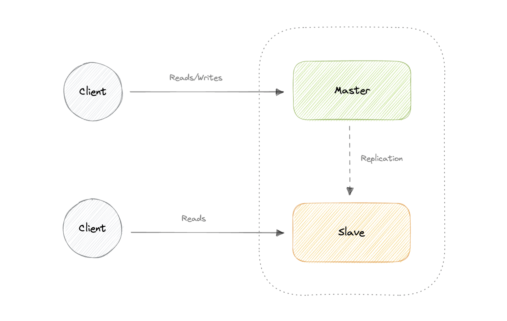

# chapter-2
- [chapter-2](#chapter-2)
  - [Database and DBMS](#database-and-dbms)
    - [Components](#components)
      - [Schema](#schema)
      - [Table](#table)
      - [Column](#column)
    - [Types](#types)
    - [Challenges](#challenges)
  - [SQL databases](#sql-databases)
  - [Database Replication](#database-replication)
    - [Master-Slave Replication](#master-slave-replication)
      - [Advantages](#advantages)
      - [Disadvantages](#disadvantages)
    - [Master-Master Replication](#master-master-replication)
      - [Advantages](#advantages-1)
      - [Disadvantages](#disadvantages-1)
    - [Synchronous vs Asynchronous replication](#synchronous-vs-asynchronous-replication)
  - [ACID and BASE consistency models](#acid-and-base-consistency-models)
  - [CAP Theorem](#cap-theorem)
  - [PACELC Theorem](#pacelc-theorem)
  - [Transactions](#transactions)

## Database and DBMS

### Components

Here're some common components found across different databases

#### Schema
The role of a schema is to define the shape of a data structure, and specify what kinds of data can go where

#### Table
Each table contains various columns just like in a spreadsheet

#### Column
A column contains a set of data values of a particular type, one value for each row of the database

### Types

Below are different types of database
+ [SQL](https://www.karanpratapsingh.com/courses/system-design/sql-databases): A collection of data items with pre-defined relationships between them
+ [NoSQL](https://www.karanpratapsingh.com/courses/system-design/nosql-databases): A broad category that includes any database that doesn't use SQL as its primary data access language
  + Document
  + Key-value
  + Graph
  + Timeseries
  + Wide column
  + Multi-model

### Challenges
Some common challenges faced while running databases at scale
+ **Absorbing significant increases in data volume**

## SQL databases

A SQL(or relational) database is a collection of data items with pre-defined relationships between them. Thease items are organized as a set of tables with columns and rows

Each row in a table could be marked with a unique identifier called a primary key. SQL databases usually follow the ACID consistency model

## Database Replication

Replication is a process that involves sharing information to ensure consistency between redundant resources such as multiple databases, to improve reliability, fault-tolerance, or accessibility

### Master-Slave Replication

The master serves reads and writes, replicating writes to one or more slaves, which serve only reads. Slaves can also replicate additional slaves in a tree-like fashion. If the master goes offline, the system can continue to operate in read-only mode until a slave is promoted to a master or a new master is provisioned

#### Advantages
+ Backups of the entire database of relatively no impact on the master
+ Applications can read from the slave(s) without impacting the master
+ Slaves can be taken offline and synced back to the master without any downtime

#### Disadvantages
+ Replication adds more hardware and additional complexity
+ Downtime and possibly loss of data when a master fails
+ All writes also have to be made to the master in a master-slave architecture
+ The more read slaves, the more we have to replicate, which will increase replication log

### Master-Master Replication
Both masters serve reads/writes and coordinate with each other. If either master goes down, the system can continue to operate with both reads and writes

#### Advantages
+ Applications can read from both masters
+ Distributes write load across both master ndoes
+ Simple, automatic, and quick failover

#### Disadvantages
+ Not as simple as master-slave to configure and deploy
+ Either loosely consistent or have increased write latency due to synchronization
+ Conflict resolution comes into play as more write nodes are added and as latency increases

### Synchronous vs Asynchronous replication

The primary difference between synchronous and asynchronous replication is how the data is written to the replica. In synchronous replication, data is written to primary storage and the replica simultaneously. As such, the primary copy and the replica should always remain synchronized

In contrast, asynchronous replication copies the data to the replica after the data is already written to the primary storage. Although the replication process may occur in near-real-time, it's more common for replication to occur on a scheduled basis and it's more cost-effective

## ACID and BASE consistency models
The term ACID stands for Atomicity, Consistency, Isolation, and Durability. ACID properties are used for maintaining data integrity during transaction processing
+ **Atomic** : All operations in a transaction succeed or every operation is rolled back
+ **Consistent** : On the completion of a transaction, the database is structurally sound
+ **Isolated** : Transactions don't contend with one another. Contentious access to data is moderated by the database so that transactions appear to run sequentially
+ **Durable** : Once the transaction has been completed and the writes and updates have been written to the disk, it will remain in the system even if a system failure occurs

BASE properties are much looser than ACID properties
+ **Basic Availability** : The database appears to work most of the time
+ **Soft-state** : Stores don't have to be write-consistent, nor do different replicas have to be mutually consistent all the time
+ **Eventual consistency** : The data might not be consistent immediately but eventually, it becomes consistent. Reads in the system are still possible even though they may not give the correct response due to inconsistency

## CAP Theorem
CAP theorem states that a distributed system can deliver only two of the three desired characteristics: Consistency, Availability, and Partition tolerance(CAP)

+ **Consistency** : Consisitency means that all clients see the same data at the same time, no matter which node they connect to. For this to happen, whenever data is written to one node, it must be instantly forwarded or replicated across all the nodes in the system before the write is deemed "successfully"
+ **Availability** : Availability means that any client making a request for data gets a response, even if one or more nodes are down
+ **Partition tolerance** : Partition tolerancer means the system continues to work despite message loss or partial failure

We live in a physical world and can't guarantee the stability of a network, so distributed databases must choose Partition Tolerance(P). This implies a tradeoff between Consistency(C) and Availability(A)
+ **CA database** : A CA database delivers consistency and availabity across all nodes. It can't do this if there's a partition between any two nodes in the system, and therefore can't deliver fault tolerance. Examples: [MariaDB](https://mariadb.org/), [PostgreSQL](https://www.postgresql.org/)
+ **CP database** : A CP database delivers consistency and partition tolerance at the expense of availabity. When a partition occur between any two nodes, the system has to shut down the non-consistent node until the partition is resolved. Examples: [MongoDB](https://www.mongodb.com/)
+ **AP database** : An AP database delivers availability and partition tolerance at the expense of consistency. When a partition occurs, all nodes remain available but those at the wrong end of a partition might return an older version of data than others. When the partition is resolved, the AP databases typically re-syncs the nodes to repair all inconsistencies in the system. Examples: [Cassandra](https://cassandra.apache.org/)

## PACELC Theorem
The CAP theorem states that in the case of network partitioning(P) in a distributed system, one has to choose between Availability(A) and Consistency(C)

PACELC extends the CAP theorem by introducing latency(L) as an additional attribute of a distributed system. The theorem states that else(E), even when the system is running normally in the absence of partitions, one has to choose between latency(L) and consistency(C)

## Transactions
A transaction is a series of database operations that are considered to be a single unit of work. The operations in a transaction either all succeed, or they all fail

*Usually relational databases support ACID transactions, and non-relational databases don't*

A transaction in a database can be in one of the following states

+ **Active** : The transaction is being executed. This's the initial state of every transaction
+ **Partially Committed** : When a transaction executes its final operation, it's said to be in partially committed state
+ **Committed** : If a transaction executes all its operations successfully, it's said to be committed. All its effects are now permanently established on the database system
+ **Failed** : The transaction is said to be in a failed state if any of the checks made by the database recovery system fails. A failed transaction can no longer proceed further
+ **Aborted** : If any of the checks fail and the transaction has reached a failed state, then the recovery manager rolls back all its write operations on the database to bring the database back to its original state where it was prior to the execution of the transaction. The database recovery module can select one of the two operations after a transaction aborts: restart the transaction or kill the transaction
+ **Terminated** : If there isn't any roll-back or the transaction comes from the committed state, then the system is consistent and ready for a new transaction and the old transaction is terminated