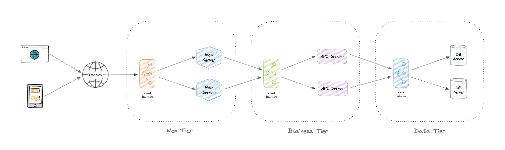

# chapter-3

## N-tier architecture
N-tier architecture divides an application into logical layers and physical layers. Layers are a way to separate responsibilities and manage dependencies. Each layer has a specific responsibility. A higher layer can use services in a lower layer, but not the other way around

An N-tier architecture can be of two types:
1. In a closed layer architecture, a layer can only call the next layer immediately down
2. In a open layer architecture, a layer can call any of the layers below it

Let's look at some examples of N-Tier architecture:
+ **3-Tier architecture** : 3-Tier is widely used and consists of the following different layers:
  + *Presentation layer* : Handles user interactions with the application
  + *Business logic layer* : Accepts the data from the application layer, validates it as per business logic and passes it to the data layer
  + *Data access layer* : Receives the data from the business layer and performs the necessary operation on the database
+ **2-Tier architecture** : In this architecture, the presentation layer runs on the client and communicates with a data store. There's no business logic layer or immediate layer between client and server
+ **1-Tier architecture** : It's the simplest one as it's equivalent to running the application on a personal computer. All of the required components for an application to run are on a single application or server

:::: row Pros and Cons
::: col
Here're some advantages of using N-tier architecture:
+ Can improve availability
+ Better security as layers can behave like a firewall
+ Separate tiers allow us to scale as needed
+ Improve maintainance as different people can manage different tiers
:::
::: col
Below are some disadvantages of using N-tier architecture:
+ Increased complexity of the system as a whole
+ Increased network latency as the number of tiers increases
+ Expensive as every layer will have its own hardware cost
+ Difficult to manage network security
:::
::::

## Message Brokers
A message broker is a software that enables applications, systems, and services to communicate with each other and exchange information. The message broker does this by translating messages between formal messaging protocols

Message brokers offer two basic message distribution patterns or messaging styles:
+ Point-to-Point messaging : This's the distribution pattern utilized in message queues with a one-to-one relationship between the message's sender and receiver
+ Publish-subscribe messaging : In this message distribution, often referred to as pub/sub, the producer of each message publishes it to a topic, and multiple message consumers subscribe to topics from which they want to receive messages

Let's discuss some advantages of using a message queue:
+ Scalability
+ Decoupling
+ Performance
+ Relability

If queues start to grow significantly, the queue size can become larger than memory, resulting in cache misses, disk reads, and even slower performance. Backpressure can help by limiting the queue size, thereby maintaining a high throughput rate and good response times for jobs already in the queue. Once the queue fills up, clients get a server busy or HTTP 503 status code to try again later. Clients can retry the request at a later time, perhaps with [exponential backoff](https://en.wikipedia.org/wiki/Exponential_backoff) strategy

## Monoliths and Microservices
A monoliths is a self-contained and indepedent application

A microservice architecture consists of a collection of small, autonomous services where each service is self-contained and should implement a single business capability within a bounded context

## API Gateway
