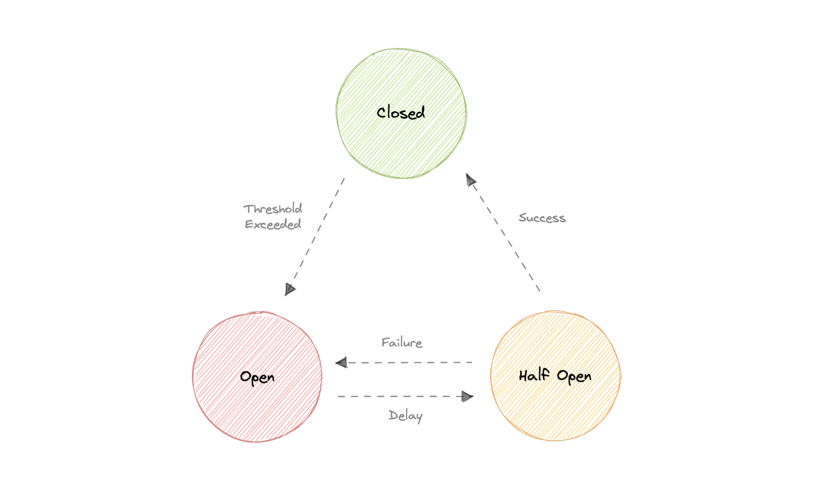
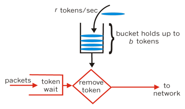
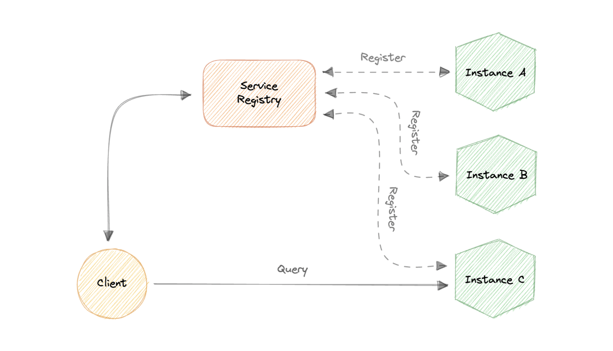
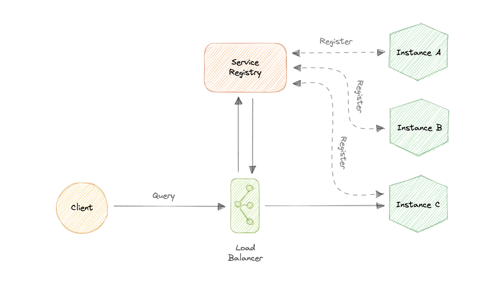

# chapter-4

## Circuit Breaker

The circuit breaker is a design pattern used to detect failures and encapsulates the logic of preventing a failure from constantly recurring during maintaince, temporary external system failure, or unexpected system difficulties

The basic idea behind the circuit breaker is very simple. We wrap a protected function call in a circuit breaker object, which monitors for failures. Once the failures reach a certain threshold, the circuit breaker trips, and all further calls to the circuit breaker return with an error, without the protected call being made at all

Why do we need circuit breaking?

+ It's common for software systems to make remote calls to software running in different processes, probably on different machines across a network. One of the big differences between in-memory calls and remote calls is that remote calls can fail, or hang without a response until some timeout limit is reached
+ What's worse is if we have many callers on an unresponsive supplier, then we can run out of critical resources leading to cascading failures across multiple systems

Let's discuss circuit breaker states:

+ **Closed** : When everything is normal, the circuit breakers remain closed, and all the request passes through to the services as normal. If the number of failures increases beyond the threshold, the circuit breaker trips and goes into an open state
+ **Open** : In this state circuit breaker returns an error immediately without even invoking the services. The circuit breakers move into the half-open state after a certain timeout period elapses. Usually it will have a monitoring system where the timeout will be specified
+ **Half-Open** : In this state the circuit breaker allows a limited number of requests from the service to pass through and invoke the operation. If the requests are successful, then the circuit breaker will go to the closed state. However, if the requests continue to fail, then it goes back to the open state

## Rate Limiting

Rate limiting refers to preventing the frequency of an operation from exceeding a defined limit

Why do we need rate limiting? Rate limiting is a very important part of any large-scale system and it can be used to accomplish the following:

+ Avoid resource starvation as a result of Denial of Service(DoS) attacks
+ Controlling operational costs by putting a virtual cap on the auto-scaling of resources which if not monitored might lead to exponential bills
+ Defense or mitigation against some common attacks
+ For APIs that process massive amounts of data, rate limiting can be used to control the flow of that data

There're various algorithms for API rate limiting, each with its advantages and disadvantages

+ **Leaky Bucket** : Leaky Bucket is an algorithm that provides a simple, intuitive approach to rate limiting via a queue 
  + When registering a request, the system appends it to the end of queue
  + Processing for the first item on the queue occurs at a regular interval or first-in, first-out
  + If the queue is full, then additional requests are discarded(or leaked)
+ **Token Bucket** : When a request comes in, a token from the bucket must be taken and processed. The request will be refused if no token is available in the bucket, and the requester will have to try again later. As a result, the token bucket gets refreshed after a certain time period. 
+ **Fixed Window**
+ **Sliding Log**
+ **Sliding Window**

Rate Limiting becomes complicated when distributed systems are invoked. The two broad problems that come with rate limiting in distributed systems are:

1. **Inconsistencies**
2. **Race conditions**

## Service Discovery

Service discovery is the detection of services within a computer network. Service Discovery Protocol(SDP) is a networking standard that accomplishes the detection of networks by identifying resources

Why do we need service discovery? Modern microservices-based application typically run in virtualized or containerized environments where the number of instances of a service and their locations change dynamically. Consequently, we need a mechanism that enables the clients of service to make requests to a dynamically changing set of ephemeral service instances

+ **Client-side discovery** : The client obtains the location of another service by querying a service registry which is responsible for managing and storing the network locations of all the service 
+ **Server-side discovery** : Use an intermediate component such as a load balancer. The client makes a request to the service via a load balancer which then forwards the request to an available service instance 

## SLA SLO SLI

+ **SLA** : An SLA, or Service Level Agreement, is an agreement made between a company and its users of a given service
+ **SLO** : An SLO, or Service Level Objective, is the promise that a company makes to users regarding a specific metric such as incident response or uptime
+ **SLI** : An SLI, or Service Level Indicator, is a key metric used to determine whether or not the SLO is being met

## Disaster Recovery

Disaster recovery(DR) is a process of regaining access and functionality of the infrastructure after events like a natural disaster, cyber stack, or even business disruptions

## Single Sign-On (SSO)

Single Sign-On(SSO) is an authentication process in which a user is provided access to multiple applications or websites by using only a single set of login credentials. This prevents the need for the user to log separately into the different applications

The user credentials and other identifying information are stored and managed by a centralized system called Identity Provider(IdP). The Identity Provider is a trusted system that provides access to other websites and applications

Single Sign-On(SSO) based authentication systems are commonly used in enterprise environments where employees require access to multiple applications of their organizations

**How does SSO work?**

1. The users request a resource from their desired applications
2. The application redirects the user to the Identity Provider(IdP) for authentication
3. The user signs in with their credentials (usually username and password)
4. IdP sends a SSO response back to the client application
5. The application grants access to the user

:::: row Pros and Cons
::: col
Following are the benefits of using Single Sign-On:

+ Ease of use as users only need to remember one set of credentials
+ Ease of access without having to go through a lengthy authorization process
+ Enforced security and compliance to protect sensitive data
+ Simplifying the management with reduced IT support cost and admin time

:::
::: col
Here are some disadvantages of Single Sign-On:

+ Single Password Vulnerability. If the main SSo password gets compromised, all the supported applications get compromised
+ The authentication process using Single Sign-On is slower than tradition authentication as every application has to request the SSO provider for verfication

:::
::::
