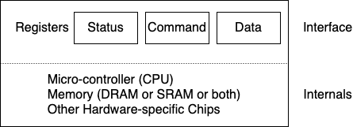

# Persistence

## I/O Devices

### Prototypical System Architecture
The picture shows a single CPU attached to the main memory of the system via some kind of **memory bus** or interconnect. Some devices are connected to the system via a general **I/O bus**, which in many modern systems would be PCI (or one of its many derivatives); graphics and some other higher-performance I/O devices might be found here. Finally even lower down are one or more of what we call a **peripheral bus**, such as SCSI, SATA, or USB. These connect the slowest devices to the system, including disks, mice, and other similar components


::: tip Why do we need a hierarchical structure like this
Put simply: physics and cost

1. The faster a bus is , the shorter it must be; thus a high-performance memory bus does not have much room to plug devices and such into it
1. In addition, engineering a bus for high performance is quite costly. Thus, system designers have adopted this hierarchical approach, where components that demand high performance (such as graphics card) are nearer the CPU, while lower performance components are further away
:::

### A Canonical Device & The Canonical Protocol

A canonical device has two important components



1. The first is the hardware **interface** it presents to the rest of the system. The simplified device interface is comprised of three registers. By reading and writing these registers, the operating system can control device behavior
    1. a **status** register, which can be read to see the current status of the device
    1. a **command** register, to tell the device to perform a certain task
    1. a **data** register to pass data to the device, or get data from the device (When the main CPU is involved with the data movement, we refer to it as **programmed I/O(PIO)**)
1. The second part of any device is its **internal structure**. This part of the device is implementation specific and is reponsible for implementing the abstraction the device presents to the system

### Lowering CPU Overhead With Interrupts
**How can the OS check device status without frequent polling, and thus lower the CPU overhead required to manage the device?**

Instead of polling the device repeatedly, the OS can issue a request, put the calling process to sleep, and context switch to another task. When the device is finally finished with the operation, it will raise a hardware interrupt, causing the CPU to jump into the OS at a pre-determined **interrupt service routine (ISR)** or more simply an **interrupt handler**. The handler is just a piece of operating system code that will finish the request and wake the process waiting for the I/O, which can then proceed as desired. Interrupts thus allow for **overlap** of computation and I/O, which is key for improved utilization

> Interrupts not always better than PIO

### More Efficient Data Movement With DMA
**With programmed I/O (PIO) the CPU spends too much time moving data to and from devices by hand. How can we offload this work and thus allow the CPU to be more effectively utilized?**

A **DMA (Direct Memory Access)** engine is essentially a very specific device within a system that can orchestrate transfers between devices and main memory without much CPU intervention

DMA works as follows. To transfer data to the device, for example, the OS would program the DMA engine by telling it where the data lives in memory, how much data to copy, and which device to send it to. At that point, the OS is done with the transfer and can proceed with other work. When the DMA is complete, the DMA controller raises an interrupt, and the OS thus knows the transfer is complete

### Methods Of Device Interaction
How should the hardware communicate with a device?

There're two primary methods of device communication
1. Explicit **I/O instructions** : These instructions specify a way for the OS to send data to specific device registers. Such instructions are usually **privileged**
1. **Memory-mapped I/O** : With the approach, the hardware makes device registers available as if they were memory locations. To access a particular register, the OS issues a load (to read) or store (to write) the address; the hardware then routes the load/store to the device instead of main memory

### Fitting Into The OS: The Device Driver
How can we keep most of the OS device-neutral, thus hiding the details of device interactions from major OS subsystems?


At the lowest level, a piece of software in the OS must know in detail how a device works. We call this piece of software a **device driver**, and any specifics of device interaction are encapsulated within

::: section Device Driver
Interestingly, because device drivers are needed for any device you might plug into your system, over time they have come to represent a huge percentage of kernel code. Studies of the Linux kernel reveal that over 70% of OS code is found in device drivers
:::

## Hard Disk Drives

### I/O Time: Doing The Math
$$T_{I/O} = T_{seek}+T_{rotation}+T_{transfer}$$


## File System Implementation
> How can we build a simple file system? What structures are needed on the disk? What do they need to track? How are they accessed?

### The Way To Think & Overall Organization
To think about file systems, we usually suggest thinking about two different aspects of them
1. **The data structures of the file system**
1. **Access methods**

::: section Mental Models Of File Systems
Mental models are what you are really trying to develop when learning about systems. By working on and improving your mental model, you develop an abstract understanding of what is going on, instead of just trying to understand the specifics of some file-system code
:::

We now develop the overall on-disk organization of the data structures of the vsfs (very simple file system). The first thing we'll need to do is divide the disk **blocks**; simple file systems use just one block size, and that's exactly what we'll do here. Let's choose a commonly-used size of 4KB

Our view of the disk partition where we're building our file system is simple: a series of blocks, each of size 4KB. The blocks are addressed from $0$ to $N-1$, in a partition of size $N$ 4KB blocks. Assume we have a really small disk, with just 64 blocks


Let's call the region of the disk we use for user data the **data region**. The file system has to track information about each file. This information is a key piece of **metadata**, and tracks things like which data blocks in the data region comprise a file, the size of the file, its owner and access rights, access and modify times, and other similar kinds of information. To store this information, file systems usually have a structure called an **inode**

To accommodate inodes, we'll need to reserve some space on the disk for them as well. Let's call this portion of the disk the **inode table**, which simply holds an array of on-disk inodes

File system needs to track whether inodes or data blocks are free or allocated. Such **allocation structures** are thus a requisite element in any file system. We choose a simple and popular structure known as a **bitmap**, one for the data region (the **data bitmap**) and one for the inode table (the **inode bitmap**)

::: section Bitmap
A bitmap is a simple structure: each bit is used to indicate whether the corresponding object/block is free(0) or in-use(1)
:::

The **superblock** contains information about this particular file system, including how many inodes and data blocks are in the file system, where the inode table begins and so forth. **When mounting a file system, the OS will read the superblock first, to initialize various parameters, and then attach the volume to the file-system tree**

### File Organization: The Inode
The inode is the generic name that is used in many file systems to describe the structure that holds the metadata for a given file, such as its length, permissions, and the location of its constituent blocks. It's short for **index node**


Each inode is implicitly referred to by a number (called the **inumber**), which we've earlier called the **low-level name** of the file。 In file system, given an $i$-number, you should directly be able to calculate where on the disk the corresponding inode is located
```
blk = (inumber * sizeof(inode_t)) / block_size
sector = ((blk * block_size) + inode_start_addr) / sector_size
```

Inside each inode is virtually all of the information you need about a file. We refer to all such information about a file as **metadata**

<center>_**Simplified Ext2 Inode**_</center>

| Size | Name | What is this inode field for |
| -- | -- | -- |
| 2 | mode | can this file be read/written/executed? |
| 2 | uid | who owns this file? |
| 4 | size | how many bytes are in this file? |
| 4 | time | what time was this file last accessed? |
| 4 | ctime | what time was this file created? |
| 4 | mtime | what time was this file last modified? |
| 4 | dtime | what time was this file deleted |
| 2 | gid | which group does this file belong to? |
| 2 | links_count | how many hard links are there to this file? |
| 4 | blocks | how many blocks have been allocated to this file? |
| 4 | flags | how should ext2 use this inode? |
| 4 | osd1 | an OS-dependent field |
| 60 | block | a set of disk pointers (15 total) |
| 4 | generation | file version (used by NFS) |
| 4 | file_acl | a new permissions model beyond mode bits |
| 4 | dir_acl | called access control lists |

One of the most important decisions in the design of the inode is how it refers to where data blocks are. One simple approach would be to have one or more **direct pointers** (disk addresses) inside the inode; each pointer refers to one disk block that belongs to the file. Such an approach is limited: if you want to have a file that is really big, you're out of luck

<center>_**File System Measurement Summary**_</center>


### Directory Organization

A directory basically just contains a list of (entry name, inode number) pairs. For each file or directory in a given directory, there's a string and a number in the data block(s) of the directory. For each string, there may also be a length (assuming variable-sized names)

| inum | reclen | strlen | name |
| -- | -- | -- | -- |
| 5 | 4 | 2 | . |
| 2 | 4 | 3 | .. |
| 12 | 4 | 4 | foo |
| 13 | 4 | 4 | bar |
| 24 | 8 | 7 | foobar |

Often file systems treat directories as a special type of file. Thus a directory has an inode, somewhere in the inode table (with the type field of the inode marked as "directory" instead of "regular file")

### Free Space Management
A file system must track which inodes and data blocks are free, and which are not, so that when a new file or directory is allocated, it can find space for it. Thus **free space management** is important for all file systems

For example, when we create a file, we will have to allocate an inode for that file. The file system will thus search through the bitmap for an inode that is free, and allocate it to the file; the file system will have to mark the inode as used (with a 1) and eventually update the on-disk bitmap with the correct information

### Access Paths: Reading and Writing

Let us assume that the file system has been mounted and thus that the superblock is already in memory. Everything else (i.e., inodes, directories) is still on the disk

#### Reading A File From Disk

All traversals begin at the root of the file system, in the **root directory** which is simply called /. Thus the first thing the FS will read from disk is the inode of the root directory. The root has no parent (by definition). Thus the root inode number must be well known: the FS must know what it is when the file system is mounted. **In most UNIX file systems, the root inode number is 2**

<center>_**File Read Timeline (Time Increasing Downward)**_</center>

[File Read Timeline (Time Increasing Downward)](./sheets/file-read-timeline.luckysheet){link-type="luckysheet"}

Note that the amount of I/O generated by the open is proportional to the length of the pathname

> Read don't access allocation structures

#### Writing to Disk

Writing to a file is a similar process. First the file must be opened (as above). Then the application can issue `write()` calls to update the file with new contents. Finally, the file is closed

Unlike reading, writing to the file entry may also **allocate** a block

<center>_**File Creation Timeline (Time Increasing Downward)**_</center>

[File Creation Timeline (Time Increasing Downward)](./sheets/file-write-timeline.luckysheet){link-type="luckysheet"}

### Caching and Buffering
::: section How to reduce file system I/O costs
Even the simplest of operations like opening, reading or writing a file incurs a huge number of I/O operations, scattered over the disk. What can a file system do to reduce the high costs of doing so many I/Os?
:::

To remedy what would clearly be a huge performance problem, most file systems aggressively use system memory (DRAM) to cache important blocks

Modern systems employ a **dynamic partitioning** approach. Specifically, many modern OS integrate virtual memory and file system pages into a **unified page cache**. In this way memory can be allocated more flexibly accross virtual memory and file system, depending on which needs more memory at a given time

::: tip Understanding static Vs. dynamic partitioning
When dividing a resource among different clients/users, you can either **static partitioning** or **dynamic partitioning**

The static approach simply divides the resource into fixed proportions once. The dynamic approach is more flexible, giving out different amounts of the resource over time

Static partitioning ensures each user receives some share of the resource, usually delivers more predictable performance, and is often easier to implement

Dynamic partitioning can achive better utilization (by letting resource-hungry users consume otherwise idle resources), but can be more complex to implement and can lead to worse performance
:::

Most modern file systems buffer writes in memory for anywhere between five and thirty seconds, representing yet another trade-off: if the system crashes before the updates have been propagated to disk, the updates are lost; however, by keeping writes in memory longer, performance can be improved by **batching, scheduling, and even avoiding writes**

> Storage systems often present a durability/performance trade-off to users