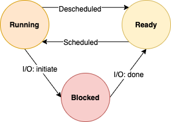

# Virtualization - CPU

## The Abstraction - The Process

### The Abstraction - A Process
A **process** is a **running program**

Although there're only a few physical CPUs available, how can the OS provide the illusion of a nearly-endless supply of CPUs? The OS creates this illusion by **virtualizing** the CPU

**Mechanisms** are low-level methods or protocols that implement a needed piece of functionality

On top of these mechanisms resides some of the intelligence in the OS in the form of policies. **Policies** are algorithms for making some kind of decision within the OS

::: tip Separate Policy and Mechnism
In many operating systems, a common design paradigm is to separate high-level policies from their low-level mechnisms. Separating the two allows one easily to change policies without having to rethink the mechanism and is thus a form of **modularity**, a general software design principle
:::

### Process States
A process can be in one of three states:
+ **Running** : In the running state, a process is running on a processor. This means it is executing instructions
+ **Ready** : In the ready state, a process is ready to run but for some reason the OS has chosen not to run it at this given moment
+ **Blocked** : In the blocked state, a process has performed some kind of operation that makes it not ready to run until some other event takes place

## Mechanism - Limited Direct Execution
### Basic Technique: Limited Direct Execution

The basic idea is straightforward: just run the program you want to run on the CPU, but first make sure to set up the hardware so as to limit what the process can do without OS assistance

***Direct Execute Protocol (Without Limits)***

| OS | Program |
| -- | -- |
| Create entry for process list Allocate memory for program Load program into memory Set up stack with argc/argv Clear registers Execute **call** main() |  |
| | Run main() Execute **return** from main |
| Free memory of process Remove from process list | |

### Problem #1: Restricted Operations
> A process must be able to perform I/O and some other restricted operations, but without giving the process complete control over the system. How can the OS and hardware work together to do so?

::: tip Use Protected Control Transfer
The hardware assists the OS by providing different modes of execution. In **user mode**, applications don't have full access to hardware resources. In **kernel mode**, the OS has access to the full resources of the machine. Special instructions to **trap** into kernel and **return-from-trap** back to user-mode programs are also provided, as well instructions that allow the OS to tell the hardware where the **trap table** resides in memory
:::

***Limited Direct Execute Protocol***

| OS @ boot (kernel mode) | Hardware |  |
| -- | -- | -- |
| **initialize trap table** | remember address of... syscall handler |  |

| OS @ run (kernel mode) | Hardware | Program (user mode) |
| -- | -- | -- |
| Create entry for process list Allocate memory for program Load program into memory Set up user stack with argc/argv Fill kernel stack with reg/PC **return-from-trap** |  |  |
| | restore regs from kernel stack move to user mode jump to main | |
| | | Run main() ... Call system call **trap** into OS |
| | save regs to kernel stack move to kernel mode jump to trap handler | |
| Handle trap Do work of syscall **return-from-trap** | | |
| | restore regs from kernel stack move to user mode jump to PC after trap | |
| | | ... return from main **trap**(via exit()) |
| Free memory of process Remove from process list | | |

### Problem #2: Switching Between Processes

**Cooperative approach** : The OS trusts the processes of the system to behave reasonably. Processes that run for too long are assumed to periodically give up the CPU so that the OS can decide to run some other task

**In a cooperative scheduling system, the OS regains control of the CPU by waiting for a system call or an illegal operation of some kind to take place**

> How can the operating system **regain control** of the CPU so that it can switch between processes, even if processes are not being cooperative?

**Timer interrupt** : A timer device can be programmed to raise an interrupt every so many milliseconds; when the interrupt is raised, the currently running process is halted, and a pre-configured **interrupt handler** in the OS runs. At this point the OS has regained control of the CPU

::: tip Use the Timer Interrupt to Regain Control
The addition of a **timer interrupt** gives the OS the ability to run again on a CPU even if processes act in a non-cooperative fashion. Thus, this hardware feature is essential in helping the OS maintain control of the machine
:::

***Limited Direct Execution Protocol (Timer Interrupt)***

| OS @ boot (kernel mode) | Hardware |  |
| -- | -- | -- |
| **initialize trap table** | remember address of... syscall handler |  |
| **start interrupt timer** | start timer interrupt CPU in X ms | -- |

| OS @ run (kernel mode) | Hardware | Program (user mode) |
| -- | -- | -- |
| |  | Process A ... |
| | **timer interrupt** save regs(A) to k-stack(A) move to kernel mode jump to trap handler | |
| Handle the trap Call switch() routine   save reg(A) to proc-struct(A)   restore reg(B) from proc-struct(B)   switch to k-stack(B) **return-from-trap (into B)** | | |
| | restore regs(B) from k-stack(B) move to user mode jump to B's PC | |
| | | Process B ... |

A **context switch** is conceptually simple: all the OS has to do is save a few register values for the currently-executing process (onto its kernel stack, for example) and restore a few for the soon-to-be-executing process (from its kernel stack). By doing so, the OS thus ensures that when the return-from-trap instruction is finally executed, instead of returning to the process that was running, the system resumes execution of another process

## Scheduling: Introduction

