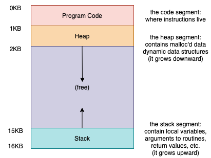
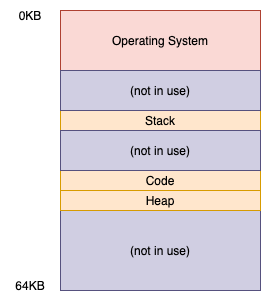
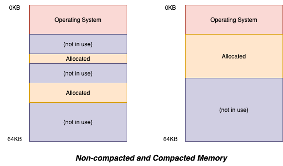
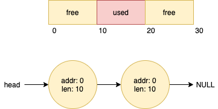

# Virtualization - Memory

## The Abstraction - Address Spaces
> How can the OS build this abstraction of a private, potentially large address space for multiple processes (all sharing memory) on top of a single, physical memory?

The **address space** is the running program's view of memory in the system

### Goals
+ **Transparency** : the illusion provided by the OS should not be visible to applications. In common usage, a transparent system is one that is hard to notice
+ **Efficiency** : the OS should strive to make the virtualization as efficient as possible, both in terms of time (i.e., not making programs run much more slowly) and space (i.e., not using too much memory for structures needed to support virtualization)
+ **Protection** : the OS should make sure to protect processes from one another as well as the OS itself from processes. Protection thus enables us to deliver the property of **isolation** among processes

## Mechanism: Address Translation

### Assumptions
+ The user's address space must be placed _contiguously_ in physical memory
+ The size of the address space is _less than_ the size of _physical memory_
+ Each address space is exactly the _same size_

### Dynamic (Hardware-based) Relocation

Each memory reference generated by the process is a **virtual address**; the hardware in turn adds the contents of the base register to this virtual address and the result is a **physical address** that can be issued to the memory system

$$\text{physical address}=\text{virtual address}+base$$

Transforming a virtual address into a physical address is exactly the technique we refer to as **address translation**. Because this relocation of the address happens at runtime, and because we can move address spaces even after the process has started running, the technique is often referred to as **dynamic relocation**

_**Dynamic Relocation: Hardware Requirements**_

| Hardware Requirements | Notes |
| -- | -- | 
| Privileged mode | Needed to prevent user-mode processes from executing privileged operations |
| Base/bounds registers | Need pair of registers per CPU to support address translation and bounds check |
| Ability to translate virtual addresses and check if within bounds | Circuitry to do translations and check limits; in this case, quite simple |
| Privileged instruction(s) to update base/bounds | OS must be able to set these values before letting a user program run |
| Privileged instruction(s) to register exception handlers | OS must be able to tell hardware what code to run if exception occurs |
| Ability to raise exceptions | When processes try to access privileged instructions or out-of-bounds memory |

_**Dynamic Relocation: Operating System Responsibilities**_

| OS Requirements | Notes |
| -- | -- |
| Memory management | Need to allocate memory for new processes; Reclaim memory from terminated processes; Generally manage memory via **free list** |
| Base/bounds management | Must set base/bounds properly upon context switch |
| Exception handling | Code to run when exceptions arise; likely action is to terminate offending process |

## Segmentation

A segment is just a contiguous portion of the address space of a particular length

The idea of **segmentation** is simple: instead of having just one base and bounds pair in our MMU, why not have a base and bounds pair per logical segment of the address space?  What segmentation allows the OS to do is to place each one of those segments in different parts of physical memory, and thus avoid filling physical memory with unused virtual address space

## Free-Space Management
::: section How to manage free space
How should free space be managed, when satisfying variable-sized requests? What strategies can be used to minimize fragmentation? What are the time and space overheads of alternate approaches?
:::

## Paging - Introduction

## Paging: Faster Translation (TLBs)