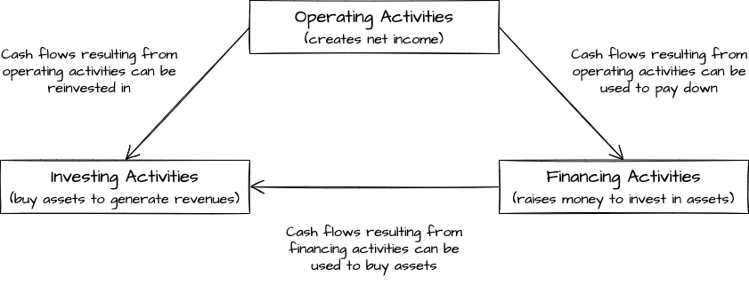

# Introduction to Financial Accounting

## Accounting Defined

**Accounting** is the process of identifying, measuring, recording, and communicating an organization's economic activities to users

**Internal users** work for the organization while **external users** do not

**Managerial accounting** serves the decision-making needs of internal users

**Financial accounting** is the area of accounting that focues on external reporting and meeting the needs of external users (include investors, creditors, labour unions, and customers)

## Business Organizations
An **organization** is a group of individuals who come together to pursue a common set of goals and objectives

A **business organization** sells products and/or services for profit. A **non-business organization**, such as a charity or hospital, exists to meet various societal needs and does not have profit as a goal

The three forms of business organizations are:
1. **Proprietorship**
1. **Partnership**
1. **Corporation**

| Characteristic | Proprietorship | Partnership | Corporation |
| -- | -- | -- | -- |
| Separate legal entity | No | No | Yes |
| Business income is taxed as part of the business | No | No | Yes |
| Unlimited liability | Yes | Yes | No |
| One owner permitted | Yes | No | Yes |
| Board of Directors | No | No | Yes |

## Generally Accepted Accounting Principles

## Financial Statements

Recall that financial accounting focues on communicating information to external users. That infomation is communicated using **financial statements**

The four financial statements are:
+ **Income statement** : The income statement reports financial performance by detailing revenues less expenses to arrive at net income/loss for the period
+ **Statement of changes in equity** : The statement of changes in equity shows the changes during the period to each of the components of equity
+ **Balance sheet** : The balance sheet identifies financial position at a point in time by listing assets, liabilities, and equity
+ **Statement of cash flows** : The statement of cash flows details the sources and uses of cash during the period based on the three business activities: operating, investing, and financing

## Transaction Analysis and Double-entry Accounting

The **accounting equation** is foundational to accounting. It shows that the total assets of a business must always equal the total claims against those assets by creditors and owners. The equation is expressed as:

$$\underbrace{Assets}_{\text{economic resources owned by an entity}} = \underbrace{Liabilities}_{\text{creditors' claims on assets}}  + \underbrace{Equity}_{\text{owners' claims on assets}}$$

This equality is the essence of _double-entry accounting_

Each economic exchange is referred to as a **financial transaction**

Accountants view financial transactions as economic events that change components within the accounting equation. These changes are usually triggered by information contained in **source documents** that can be verified for accuracy