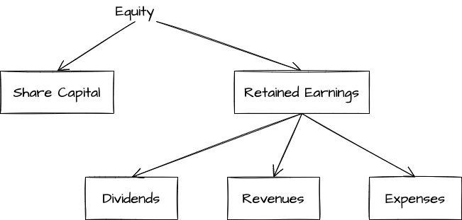

# The Accounting Process

## Accounts

An **account** accumulates detailed information regarding the increases and decreases in a specific asset, liability, or equity item
+ **Assets** : Assets are resources that have future economic benefits for the business, such as cash, receivables, prepaids, and machinery. Increases in assets are recorded as **debits** and decreases as **credits**
+ **Liabilities** : Liabilities represent an obligation to pay an asset in the future and include payables and unearned revenues. Increases in liabilities are recorded as credits and decreases as debits
+ **Equity** : Equity represents the net assets owned by the owners and includes share capital, dividends, revenues, and expenses. Increases in equity, caused by the issuance of shares and revenues, are recorded as credits, and decreases in equity, caused by dividends and expenses, are recorded as debits

A simplified account, called a **T-account**, is often used as a teaching/learning tool to show increases and decreases in an account

| Account Name ||
| -- | -- | -- |
| Debit (always on left) | Credit (always on right) |

| Assets, Dividends, Expenses ||
| -- | -- | -- |
| Debits are always increases  | Credits are always decreases |

| Liabilities, Revenues, Share Capital ||
| -- | -- | -- |
| Debits are always decreases  | Credits are always increases |

## Transaction Analysis Using Accounts

**Double-entry accounting** means each transaction is recorded in at least two accounts where the total debits ALWAYS equal the total credits

|  | Assets | Liabilities | Equity |
| -- | -- | -- |
| Increases are: | Debits | Credits | Credits |
| Decreases are: | Credits | Debits | Debits |

## The Trial Balance

To help prove the accounting equation is in balance, a trial balance is prepared. The **trial balance** is an internal document that lists all the account balances at a point in time. The total debits must equal total credits on the trial balance. The trial balance is used in the preparation of financial statements

[trial-balance](./sheets/trial-balance.luckysheet){link-type="luckysheet"}

## Using Formal Accounting Records

A business actually records transactions in a **general journal**, a document which chronologically lists each debit and credit journal entry. To summarize the debit and credit entries by account, the entries in the general journal are posted (or transfered) to the **general ledger**. The account balances in the general ledger are used to prepare the trial balance

**Posting** is the process of transferring amounts from the journal to the matching ledger accounts

## The Accounting Cycle
Analyzing transactions, journalizing them in the general journal, posting from the general journal into the general ledger, preparing the trial balance, and geenrating financial statements are steps followed each accounting period. These steps form the core of the **accounting cycle**