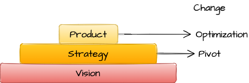

# Vision

## Introduction

::: tip Five principles of Lean Startup

1. _**Enterpreneurs are everywhere**_ and the Lean Startup approach can work in any size of company, even a very large enterprise, in any sector or industry
1. _**Enterpreneurship is management**_. "enterpreneur" should be considered as a job title in all modern companies that depend on innovation for their future growth
1. _**Validated learning**_. Startups exist to learn how to build a sustainable business. This learning can be validated scientifically by running frequent experiments that allow enterpreneurs to test each element of their vision
1. _**Build-Measure-Learn**_. Turn ideas into products, measure how customers respond, and then learn whether to pivot or persevere
1. _**Innovation accounting**_. We need focus on the boring stuff: how to measure progress, how to set up milestones, and how to prioritize work
:::

_**The goal of a startup is to figure out the right thing to build - the things customers want and will pay for - as quickly as possible**_

::: danger Why startups fail?
Planning and forecasting are only accurate when based on a long, stable operating history and a relatively static environment. Startups have neither
:::

## Start

Startups also have a true north, a destination in mind: creating a thriving and world-changing business. I call that a startup's **_vision_**. To achieve that vision, startups employ a _**strategy**_, which includes a business model, a product road map, a point of view about partners and competitors, and ideas about who the customer will be. The _**product**_ is the end result of this strategy

Products change constantly through the process of optimization, what I call _**tuning the engine**_. Less frequently, the strategy may have to change (called a _**pivot**_). However, the overarching vision rarely changes

## Define
+ Enterpreneurial prerequisites{.mindmap}
    + Proper team structure
    + Good personnel
    + A strong vision for the future
    + An appetite for risk taking

_**A startup is a human institution designed to create a new product or service under conditions of extreme uncertainty**_

## Learn

## Experiment