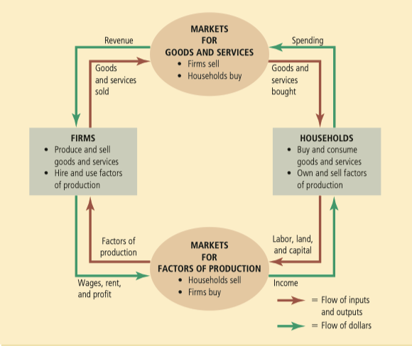

# Part 1 : Introduction

## Chapter 1 : Ten Principles of Economics

### 1.1 How People Make Decisions

Four principles about individual decision making

  1. People face trade-offs
  1. The cost of something is what you give up to get it
  1. Rational people think at the margin
  1. People respond to incentives

| Term | Explanation |
| -- | -- |
| scarcity | the limited nature of society's resources |
| economics | the study of how society manages its scarce resources |
| efficiency | the property of society getting the most it can from its scarce resources |
| equality | the property of distributing economic prosperity uniformly among the members of society |
| opportunity cost | whatever must be given up to obtain some item |
| rational people | people who systematically and purposefully do the best they can to achieve their objectives |
| marginal change | a small incremental adjustment to a plan of action |
| incentive | something that induces a person to act |

### 1.2 How People Interact

The next three principles concern how people interact with one another

1. Trade can make everyone better off
1. Markets are usually a good way to organize economic activity
1. Governments can sometimes improve market outcomes

| Term | Explanation |
| -- | -- |
| market economy | an economy that allocates resources through the decentralized decisions of many firms and households as they interact in markets for goods and services |
| property rights | the ability of an individual to own and exercise control over scarce resources |
| market failure | a situation in which a market left on its own fails to allocate resources efficiently |
| externality | the impact of one person's actions on the well-being of a bystander |
| market power | the ability of a single economic actor (or small group of actors) to have a substantial influence on market prices |

### 1.3 How the Economy as a Whole Works

1. A country's standard of living depends on its ability to produce goods and services
1. Prices rise when the government prints too much money
1. Society faces a short-run trade-off between inflation and unemployment

| Term | Explanation |
| -- | -- |
| productivity | the quantity of goods and services produced from each unit of labor input |
| inflation | an increase iin the overall level of prices in the economy |
| business cycle | fluctuations in economic activity, such as employment and production |

## Chapter 2 : Thinking Like an Economist

When economists are trying to explain the world, they are scientists; when they are trying to help improve it, they are policy advisers

When economists make normative statements, they are acting more as policy advisers than as scientists

| Term | Explanation |
| -- | -- |
| circular-flow diagram | a visual model of the economy that shows how dollars flow through markets among households and firms |
| factors of production | what is used in the production process to produce output - that is, finished goods and services |
| production possibilities frontier | a graph that shows the combinations of output that the economy can possibly produce given the available factors of production and the available production technology |
| microeconomics | the study of how households and firms make decisions and how they interact in markets |
| macroeconomics | the study of economy-wide phenomena, including inflation, unemployment, and economic growth |
| positive statements | claims that attempt to describe the world as it is |
| normative statements | claims that attempt to prescribe how the world should be |

## Chapter 3 : Interdependence and the Gains from Trade

| Term | Explanation |
| -- | -- |
| absolute advantage | the ability to produce good using fewer inputs than another producer |
| opportunity cost | whatever must be given up to obtain some item |
| comparative advantage | the ability to produce a good at a lower opportunity cost than another producer |
| imports | goods produced abroad and sold domestically |
| exports | goods produced domestically and sold abroad |

