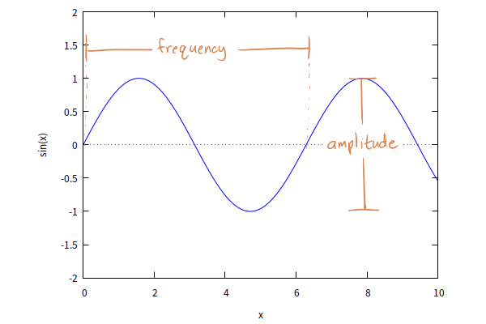

# Chapter 1 Sounds and signals

## Periodic signals

A **signal** represents a quantity that varies in time

**Sound** is variation in air pressure. A sound signal represents variations in air pressure over time

**Transducers** transduce, or convert signals from one form to another

**Periodic signals** are signals that repeat themselves after some period of time

The duration of each cycle is called **period**

**Waves** are defined by a couple of things: frequency, amplitude and shape. The particular sound you hear -- the thing that distinguishes a guitar from a violin -- is the shape of the wave, which musicians call **timbre**



**Frequency** of a signal is the number of cycles per sound, which is the inverse of the period. The units of frequency are cycles per second, or **Hertz**, abbreviated "HZ". Musicians refer to frequency as **pitch**

**Amplitude** is the distance between the lowest and highest points of the wave (it might be half that -- the distance between the highest point and zero). For sound, amplitude determines the **volume** of the sound you hear


In music, a **pitch class** (p.c. or pc) is a set of all pitches that are a whole number of **octaves** apart, e.g., the pitch class $C$ consits of the $C$s in all octaves. A **scale** is any set of musical notes ordered by fundamental frequency or pitch

The ratio between successive pitches in Western music is the twelfth root of root. Starting at 440 Hz and repeatedly multiplying by $2^{\frac{1}{12}} \approx 1.0594631$ produces twelve pitches before hitting 880 Hz

```
0    440 Hz
1    466.16 Hz
2    493.88 Hz
3    523.25 Hz
4    554.36 Hz
5    587.33 Hz
6    622.25 Hz
7    659.26 Hz
8    698.46 Hz
9    739.99 Hz
10   783.99 Hz
11   830.61 Hz
12   880 Hz
```
In music theory, an **interval** is the difference between two pitches (the ratio between two pitches), and a **semitone** is an interval of one twelfth root of two. An **octave** (perfect octave) is the interval between one musical pitch and another with half or double its frequency. For example, if one note has a frequency of 440 Hz, the note one octave above is at 880 Hz, and the note octave below is at 220 Hz. The number of octaves between two frequences is given by the formula:

$$\text{Numbers of octaves} = \log_2(\frac{f_2}{f_1})$$

```
0    1.000          = 1:1   (unison)
1    1.059                  (semitone; minor second)
2    1.122  ≈ 1.125 = 9:8   (whole tone; major second)
3    1.189                  (minor third)
4    1.260  ≈ 1.250 = 5:4   (major third)
5    1.335  ≈ 1.333 = 4:3   (perfect fourth)
6    1.414
7    1.498  ≈ 1.500 = 3:2   (perfect fifth)
8    1.587                  (minor sixth)
9    1.682  ≈ 1.667 = 5:3   (major sixth)
10   1.782                  (minor seventh)
11   1.888  ≈ 1.889 = 17:9  (major seventh)
12   2              = 2:1   (octave)
```

| Term | Explanation | Symbol |
| -- | -- | -- |
| Unison | Unison is two or more musical parts sounding the same pitch or at an octave internal, usually at the same time | $P1$ |
| Minor second (Semitone) | A semitone is the smallest musical interval commonly used in Western tonal music, and it's considered the most dissornant when sounded harmonically | $m2$ |
| Major second (Whole tone) | A major tone is a second spanning two semitones | $M2$|
| Minor third | A minor third is a musical interval that encompasses three semitones | $m3$ |
| Major third |  | $M3$ |
| Perfect fourth | | $P4$ |
| Perfect fifth | | $P5$ |
| Minor sixth | | $m6$ |
| Major sixth | | $M6$ |
| Minor seventh | | $m7$ |
| Major seventh | | $M7$ |
| Perfect Octave | Perfect octave is the internal between one musical pitch and another with double its frequency | $P8$ |

## Spectral decomposition

The **spectrum** is the set of sinusoids that add up to produce the signal

The most important mathematical idea in this book is the **discrete Fourier transform**, or **DFT**, which takes a signal and produces its spectrum

The most important algorithm in this book is the **Fast Fourier transform**, or **FFT**, which is an efficient way to compute the DFT

