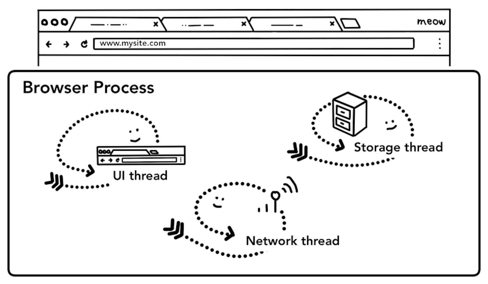

# Inside look at modern web browser

## [Part 1: CPU, GPU, Memory, and multi-process architecture](https://developer.chrome.com/blog/inside-browser-part1/) 

### At the core of the computer are the CPU and GPU

CPU cores as office workers sitting at each desk handling tasks as they come in

Many GPU cores with wrench suggesting they handle a limited task

Three layers of computer architecture. Machine Hardware at the bottom, Operating system in the middle, and Application on top

### Executing program on Process and Thread

Process as a bounding box, threads as abstract fish swimming inside of a process

Diagram of a process using memory space and storing application data

Diagram of separate processes communicating over IPC

### Browser Architecture

Different browser architectures in process/thread diagram

Diagram of Chrome's multi-process architecture. Multiple layers are shown under Renderer Process to represent Chrome running multiple Renderer Processes for each tab

### Which process controls what?

| Process | What it controls |
| -- | -- |
| Browser | Controls "chrome" part of the application including address bar, bookmarks, back and forward buttons. Also handles the invisible, previleged parts of a web browser such as network requests and file access | 
| Renderer | Controls anything inside of the tab where a website is displayed |
| Plugin | Controls any plugins used by the websites, for example, flash |
| GPU | Handles GPU tasks in isolation from other processes. It's separated into different process because GPUs handles requests from multiple apps and draw them in the same surface |

Different processes pointing to different parts of browser UI

> If you want to see how many processes are running in your Chrome, click the options menu icon more_vert at the top right corner, select More Tools, then select Task Manager. This opens up a window with a list of processes that are currently running and how much CPU/Memory they are using

### The benefit of multi-process architecture in Chrome
In the most cases, you can imagine each tab has its own renderer process. Let's say you have 3 tabs open and each tab is run by an independent renderer process. If one tab becomes unresponsive, then you can close the unresponsive tab and move on while keeping other tabs alive. **If all tabs are running on one process, when one tab becomes unresponsive, all the tabs are unresponsive**

Another benefit of separating the browser's work into multiple processes is security and sandboxing. Since operating systems provide a way to restrict processes'priivileges, the browser can sandbox certain processes from certain features. For example, the Chrome browser restricts arbitrary file access fro processes that handle arbitrary user input like the renderer process

Diagram showing multiple processes running each tab

### Saving more memory - Servicification in Chrome
Chrome is undergoing architecture changes to run each part of the browser program as a service alloing to easily split into different processes or aggregate into one

General idea is that when Chrome is running on powerful hardware, it may split each service into different processes giving more stability, but if it's on a resource-constraint device, Chrome consolidates services into one process saving memory footprint

Diagram of Chrome's servicification moving different services into multiple processes and a single browser process

### Per-frame renderer processes - Site Isolation

Diagram of site isolation; multiple renderer processes pointing to iframes within a site

## [Part 2: What happens in navigation](https://developer.chrome.com/blog/inside-browser-part2/) 

### It starts with a browser process

Browser UI at the top, diagram of the browser process with UI, network, and storage thread inside at bottom

### A simple navigation

#### Step 1: Handing input

UI Thread asking if the input is a search query or a URL

#### Step 2: Start navigation

the UI thread talking to the network thread to navigate to mysite.com

#### Step 3: Read response

response header which contains Content-Type and payload which is the actual data

Network thread asking if response data is HTML from a safe site

#### Step 4: Find a renderer process

#### Step 5: Commit navigation

IPC between the browser process and the renderer process, requesting to render the page

#### Extra Step: Initial load complete

IPC from the renderer to the browser process to notify the page has loaded

## [Part 3: Inner workings of a Renderer process](https://developer.chrome.com/blog/inside-browser-part3/) 

### Renderer processes handle web contents
The renderer process is responsible for everything that happens inside of a tab. The renderer process's core job is to turn HTML, CSS, and Javascript into a web page that the user can interact with

Renderer process with a main thread, worker threads, a compositor thread and a raster thread inside

### Parsing

#### Construction of a DOM
When the renderer process recieves a commit message for a navigation and starts to receive HTML data, the main thread beigins to parse the text string(HTML) and turn it into a Document Object Model

The DOM is a browser's internal representation of the page as well as the data structure and API that web developer can interact with via javascript

The main thread parsing HTML, and building a DOM tree

#### Subresource loading
A website usually uses external resources like images, CSS, and Javascript. Those files need to be loaded from network or cache. The main thread could request them one by one as they find them while parsing to build a DOM, but in order to speed up, preload scanner is run concurrently. If there're things like `` or `<link>` in the HTML document, preload scanner peeks at tokens generated by HTML parser and sends requests to the network thread in the browser process

#### Javascript can block the parsing
When the HTML parser finds a `<script>` tag, it pauses the parsing of the HTML document and has to load, parse, and execute the Javascript code. Why? Because Javascript can change the shape of the document using things like `document.write()` which changes the entire DOM structure.

This's why the HTML parser has to wait for Javascript to run before it can resume parsing of the HTML document

### Hint to browser how you want to load resource
There're many ways web developers can send hints to the browser to load resources nicely. If your javascript does not use `document.write()`, you can add `async` or `defer` attribute to the `<script>` tag. The browser then loads and runs the javascript code asynchronously and does not block the parsing. You may also use JavaScript module if that's suitable. `<link rel="preload">` is a way to inform browser that the resource is definitely needed for current navigation and you would like to download as soon as possible

### Style calculation
Having a DOM is not enough to know what the page would look like because we can style page elements in CSS. The main thread parses CSS and determines the computed style for each DOM node. This's information about what kind of style is applied to each element based on CSS selections

The main thread parsing CSS to add computed style

### Layout

A person standing in front  of a painting, phone line connected to the other person

The layout tree is a process to find the geometry of elements. The main thread walks through the DOM and computed styles and creates the layout tree which has information like x y coordinates and bounding box sizes. Layout tree may be similar structure to the DOM tree, but it only contains information related to what's visible on the page. If `display:none` is applied, that element is not part of the layout tree. Similarly, if a pseudo class with content like `p::before{content:"hi"}` is applied, it's included in the layout tree even though that is not in the DOM

The main thread going over DOM tree with computed styles and producing layout tree

### Paint
Having a DOM, computed style, and layout is still not enough to render a page. Let's say you are trying to reproduce a painting. You know the size, the shape, and location of elements, but you still have to judge in what order you paint them

A person in front of a carvas holding paintbrush, wondering if they should draw a circle first or square first

At the paint step, the main thread walks the layout tree to create paint records. Paint record is a note of painting process like "background first, then text, then rectangle"

The main thread walking through layout tree and producing paint records

### Updating rendering pipeline is costly
The most important thing to grasp in rendering pipeline is that at each step thre result of the previous operation is used to create new data. For example, if something changes in the layout tree, then the Paint order needs to be regenerated for affected parts of the document

Animation frames on a timeline

Animation frames on a timeline, but one frame is blocked by Javascript

You can divide Javascript operation into small chunks and schedule to run at every frame using `requestAnimationFrame()`

Smaller chunks of JavaScript running on a timeline with animation frame

## Compositing
Now that the browser knows the structure of the document, the style of each element, the geometry of the page, and the paint order, how does it draw a page? Turning this information into pixels on the screen is called rasterizing

The modern browser runs a more sophisticated process called compositing

#### What is compositing
Compositing is a technique to separate parts of a page into layers, rasterize them separately, and composite as a page in a separate thread called compositor thread. If scroll happens, since layers are already rasterized, all it has to do is to composite a new frame. Animation can be achieved in the same way by moving layers and composite a new frame

#### Dividing into layers
In order to find out which elements need to be in which layers, the main thread walks through the layout tree to create the layer tree

The main thread walking through layout tree producing layer tree

#### Raster and composite off the main thread
Once the layer tree is created and paint orders are determined, the main thread commits that information to the compositor thread. The compositor thread then rasterizes each layer. A layer could be largh like the entire length of a page, so the compositor thread divides them into tiles and sends each tile off to raster threads. Raster threads then rasterize each tile and store them in GPU memory

Raster threads creating the bitmap of tiles and sending to GPU

The compositor thread can prioritize different raster threads so that things within the viewport(or nearby) can be rastered first. A layer also has multiple tilings for different resolutions to handle things like zoom-in action

Once tiles are rastered, compositor thread gathers tile information called **draw quads**
+ Draw quads: Contains information such as the tile's location in memory and where in the page to draw the tile talking in consideration of the page compositing
+ Compositor frame: A collection of draw quads that represents a frame of a page

A compositor frame is then submitted to the browser process via IPC. At this point, another compositor frame could be added from UI thread for the browser UI change or from other renderer processes for extension. Thease compositor frames are sent to the GPU to display it on a screen. If a scroll event comes in, compositor thread creates another compositor frame to be sent to the GPU

Compositor thread creating compositing frame. Frame is sent to the browser process then to GPU

The benefit of compositing is that it is done without involving the main thread. Compositor thread does not need to wait on style calculation or JavaScript execution. This is why compositing only animations are considered the best for smooth performance. If layout or paint needs to be calculated again then the main thread has to be involved

## [Part 4: Input is coming to the Compositor](https://developer.chrome.com/blog/inside-browser-part4/)

### Input events from the browser's point of view

Input event routed through the browser process to the renderer process

### Compositor receives input events

Viewport hovering over page layers

### Understanding non-fast scrollable region

### Check if the event is cancelable

### Finding the event target

### Minimizing event dispatches to the main thread

