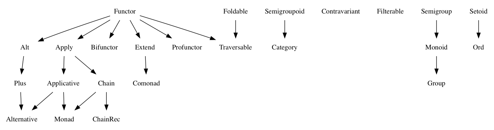

# Functional Programming Jargon



## Arity
The number of arguments a function takes

## Higher-Order Functions
A function which takes a function as an argument and/or return a function

```js
const filter = (predicate, xs) => xs.filter(predicate)

const is = type => x => Object(x) instanceof type

filter(is(Number), [0, '1', 2, null])
```

## Closure
A clousure is a scope which captures local variables of a function for access even after the execution has moved out of the block in which it is defined. This allows the values in the clousure to be accessed by returned function

```js
const addTo = (x, y) => x+y
const add5 = addTo(5)
add5(9)
```

## Partial Application
Partially applying a function means creating a new function by pre-filling some of the arguments to the original function

```js
// Helper to create partially applied functions
// Takes a function and some arguments
const partial = (f, ...args) =>
  // returns a function that takes the rest of the arguments
  (...moreArgs) =>
    // and calls the original function with all of them
    f(...args, ...moreArgs)

// Something to apply
const add3 = (a, b, c) => a + b + c

// Partially applying `2` and `3` to `add3` gives you a one-argument function
const fivePlus = partial(add3, 2, 3) // (c) => 2 + 3 + c

fivePlus(4) // 9
```

## Currying
The process of converting a function that takes multiple arguments into a function that takes them one at a time
```js
const sum = (a, b) => a+b
const currySum = a => b => a+b
```

## Auto Currying
Transform a function that take multiple arguments into one that if given less than its correct number of arguments returns a function that takes the rest. When the function gets the correct number of arguments it's then executed

## Function Composition
The act of putting two functions to form a third function where the output of one function is the input of the other

```js
const compose = (f, g) => (a) => f(g(a))
```

## Continuation
At any given point in program, the part of the code that's yet to be executed is known as a continuation

Continuations are often seen in asynchronous programming when the program needs to wait to receive data before it can continue

```js
const continueProgramWith = (data) => {
  // Continues program with data
}

readFileAsync('path/to/file', (err, response) => {
  if (err) {
    // handle error
    return
  }
  continueProgramWith(response)
})
```

## Pure Function
A function is pure if the return value is only determined by its input value, and does not produce side effects

## Side effects
A function or expression is said to have a side effect if apart from returning a value, it interacts with (reads from or writes to) external mutable state

## Idempotent
A function is idempotent if reapplying it to its result does not produce a different result

```js
sort(sort(sort(823, 5, 23)))
```

## Point-Free Style
Writing functions where the definition does not explicitly identify the arguments used. This style usually requires currying or other Higher-Order functions. A.K.A Tacit programming

## Predicate
A predicate is a function that returns true or false for a given value
```js
const predicate = x => x > 2
```

## Contracts
A contract specifies the obligations and guarantees of the behavior from a function or expression at runtime

This acts as a set of rules that are expected from the input and output of a function or expression, and errors are generally reported whenever a contract is violated

```js
// Define our contract : int -> boolean
const contract = input => {
  if (typeof input === 'number') {
    return true
  }
  throw new Error('Contract violated: expected int -> boolean')
}
const addOne = num => contract(num) && num+1
addOne(2)
addOne('hey')
```


## Category
todo

## Value
Anything that can be assigned to a variable

## Constant
A variable that can not reassigned once defined. Constants are referentially transparent. That is they can be replaced with the values that they represent without affecting the result

### Constant Function
A curried function that ignores its second argument
```js
const constant = a => () => a
```

### Constant Functor
Object whose `map` doesn't transform the contents
```js
Constant(1).map(n => n+1)
```

### Constant Monad
Object whose `chain` doesn't transform the contents
```js
Constant(1).chain(n => Constant(n+1))
```

## Functor
An object that implements a `map` function that takes a function which is run on the contents of that object. A functor must adhere to two rules:

### Preserves identity
```js
obj.map(x => x)
```
is equivalent to just `obj`

### Composable
```js
obj.map(x => g(f(x)))
```
is equivalent to
```js
object.map(f).map(g)
```

## Pointed Functor
An object with an `of` function that puts any single value into it
```js
Array.of(1) // [1]
```

## Lift
todo

## Referential Transparency
An expression that can be replaced with its value without changing the behavior of the program is said to be referentially transparent

```js
const greet = () => 'hey'
```

## Equational Reasoning
When an application is composed of expressions and devoid of side effects, truths about the system can be derived from the parts. You can also be confident about details of your system without having to go through every function

## Lambda
An anonymous function that can be treated like a value
```js
const add1 = a => a+1
```

## Lambda Calculus
A branch of mathematics that uses functions to create a universal model of computation

## Functional Combinator
todo


## Lazy evaluation
Lazy evaluation is a call-by-need evaluation mechanism that delays the evaluation of an expression until its value is needed
```js
const rand = function * () {
  while (true) {
    yield Math.random()
  }
}
const randIter = rand()
// expression is evaluated on need
randIter.next()
```

## Monoid
An object with a function that *combines* that object with another of the same type (semigroup) which has an "identity" value

## Type Signatures
Often functions in javascript will include comments that indicate the types of their arguments and return values
```js
// functionName :: firstArgType -> secondArgType -> returnType

// add :: Number -> Number -> Number
const add = a => b => a+b
// increment :: Number -> Number
const incr = a => a + 1
// call :: (a -> b) -> a -> b
const call = f => x => f(x)
```

## Algebraic data type
A composite type made from putting other types together. Two common classes of algebraic types are *sum* and *product*

### Sum type
A Sum type is the combination of two types together into another one. It's called sum because the number of possible values in the result type is the sum of the input types
```js
// imagine that rather than sets here we have types that can only have these values
const bools = new Set([true, false])
const halfTrue = new Set(['half-true'])

// The weakLogic type contains the sum of the values from bools and halfTrue
const weakLogicValues = new Set([...bools, ...halfTrue])
```
Sum types are sometimes called union types, discriminated unions, or tagged unions

### Product type
A product type combines types together in a way you're probably more familiar with
```js
const point = (x, y) => ({x, y})
```
It's called a product because the total possible values of the data structure is the product of the different values


## Monad
Monad is an object with `of` and `chain` functions. `chain` is like `map` except it un-nests the resulting nested object

> `of` is also known as `return` in other functional languages. `chain` is also known as `flatmap` and `bind` in other languages

## Comonad
An object that has `extract` and `extend` functions
```js
const CoIdentity = (v) => ({
  val: v,
  extract() {
    return this.val
  },
  extend(f) {
    return CoIdentity(f(this))
  }
})
```
Extract takes a value out of a functor
```js
CoIdentity(1).extract() // 1
```
Extend runs a function on the comonad. The function should return the same type as the comonad
```js
CoIdentity(1).extend(a => a.extract()*3) // CoIdentity(3)
```

## Applicative Functor
An applicative functor is an object with an `ap` function

This's useful if you have 2 objects and you want to apply a binary function to their contents
```js
Array.prototype.ap = function(xs) {
  return this.reduce((acc, f) => acc.concat(xs.map(f)), [])
}
[a=>a+1].ap([5,2,4])  // [6,3,5]

// Arrays that you want to combine
const arg1 = [1, 3]
const arg2 = [4, 5]

// combining function - must be curried for this to work
const add = (x) => (y) => x + y

const partiallyAppliedAdds = [add].ap(arg1) // [(y) => 1 + y, (y) => 3 + y]
partiallyAppliedAdds.ap(arg2) // [5, 6, 7, 8]
```

## Morphism
A relationship between objects within a category. In the context of functional programming all functions are morphisms

### Homomorphism


A function where there's a structural property that is the same in the input as well as the output

For example, in a Monoid homomorphism both the input and the output are monoids even if their types are different
```js
// toList :: [number] -> string
const toList = a => a.join(', ')
```
`toList` is a homomorphism because:
+ array is a monoid - has a `concat` operation and an identity value `[]`
+ string is a monid - has a `concat` operation and an identify value `''`

### Endomorphism
A function where the input type is the same as the output. Since the types are identical, endomorphisms are also homomorphisms
```js
// uppercase :: string -> string
const uppercase = str => str.toUpperCase()
```
### Isomorphism
A morphism made of a pair of transformations between 2 types of objects that is structural in nature and no data is lost
```js
const p2c = pair => ({x: pair[0], y: pair[1]})
const c2p = coords => [coords.x, coords.y]

p2c(c2p([1, 2]))
c2p(p2c({x: 1, y: 2}))
```
Isomorphisms are homomorphisms since both input and output types share the property of being reversable

## Setoid
An object that has an `equals` function which can be used to compare other objects of the same type
```js
Array.prototype.equals = function (arr) {
  const len = this.length
  if (len !== arr.length) {
    return false
  }
  for (let i = 0; i < len; i++) {
    if (this[i] !== arr[i]) {
      return false
    }
  }
  return true
}
```

## Semigroup
An object that has a `concat` function that combines it with another object of the same type
```js
[1].concat([2])
```

## Foldable
An object that has a `reduce` function that applies a function against an accumulator and each element in the array (from left to right) to reduce it to a single value
```js
const sum = list => list.reduce((acc, val)=>acc+val, 0)
sum([1,2,3])
```


## Option
Option is a sum type with two cases often called `Some` and `None`

Option is useful for composing functions that might not return a value

`Option` is also known as `Maybe`
`Some` is sometimes called `Just`
`None` is sometimes called `Noting`
```js
const Some = v => ({
  val: v,
  map(f) {
    return Some(f(this.val))
  }
  chain(f) {
    return f(this.val)
  }
})
const None = () => ({
  map(f) {
    return this
  }
  chain(f) {
    return this
  }
})
// maybeProp :: (String, {a}) -> Option a
const maybeProp = (key, obj) => typeof obj[key] === undefined ? None() : Some(obj[key])


// getItem :: Cart -> Option CartItem
const getItem = (cart) => maybeProp('item', cart)

// getPrice :: Item -> Option Number
const getPrice = (item) => maybeProp('price', item)

// getNestedPrice :: cart -> Option a
const getNestedPrice = (cart) => getItem(cart).chain(getPrice)

getNestedPrice({}) // None()
getNestedPrice({ item: { foo: 1 } }) // None()
getNestedPrice({ item: { price: 9.99 } }) // Some(9.99)
```

## Function
A function `f :: A => B` is an expression - often called arrow or lambda expression - with exactly one immutable parameter of type `A` and exactly one return value of type `B`

## Partial function
A partial function is a function which is not defined for all arguments - it might return an unexpected result or may never terminate

Partial function adds cognitive overhead, they're hard to reason about and can lead to runtime error

### Dealing with partial functions
todo