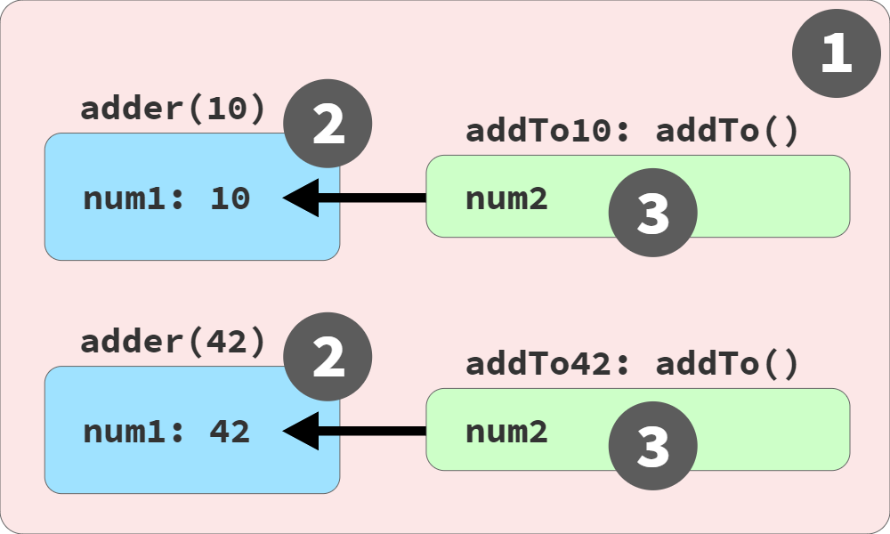

# js-scope-and-closures

## Chapter 1: What's the Scope?

JS is typically classified as an interpreted scripting language, so it's assumed by most that JS programs are processed in a single, top-down pass. **But JS is in fact parsed/compiled in a seperate phase before execution begins**.

**Scope is primarily determined during compilation**

In classic compile theory, a program is processed by a compiler in 3 basic stages:
1. Tokenizing/Lexing
1. Parsing
1. Code Generation

Two-phase processing of a JS program: compile, then execute

> It's often asserted that `let` and `const` declarations are not hoisted, as an explanation of the TDZ behavior just illustrated. But this is not accurate

```js
// --run--
function getStudentName(sid) {}
```

> The automatic association of function and variable is refered to as function hoisting

**In non-strict-mode**, there're technically still 2 ways to cheat the rule that scope is determined as the program is compiled, modifying a program's scopes during runtime
+ `eval`
```js
// --run--
function badIdea() {
    eval("var a = 'b';");
    console.log(a);
}
badIdea();
```
+ `with`
```js
// --run--
var badIdea = { a: 'b' };
with (badIdea) {
    console.log(badIdea);
}
```

**At all costs, avoid `eval` and `with`. Neigher of these cheats is available in strict-mode**

## Chapter 2: Illustrating Lexical Scope

**Lexical scope is controlled entirely by the placement of functions, blocks, and variable declarations, in relation to one another**

A scope is never partially in 2 different outer scopes. One of the key aspects of lexical scope is that any time an identifier reference can not be found in the current scope, the next outer scope in the nesting is consulted; that process is repeated until an answer is found or there are no more scopes to consult

Not defined really means not declared (undeclared), as in a variable that has no matting formal declaration in any lexically available scope. By contrast, undefined really means a variable was found (declared), but the variable otherwise has no other value in it at the moment, so it defaults to the `undefined` value

When *Engine* exhausts all *lexically  available* scopes (moving outward) and still cannot resolve the lookup of an identifier, an error condition then exits
+ If the variable is a source, an unresolved identifier lookup is considered an undeclared variable
+ If the variable is a target, and the code at that moment is running in strict-mode, the variable is considered undeclared variable

## Chapter 3: The Scope Chain
The connections between scopes that are nested within other scopes is called the cope chain, which determines the path along with variables can be accessed. The chain is directed, meaning the lookup moves upward/outward only

**The meta infomation of what scope a variable originates from is usually determined during the initial compilation processing**

When a variable name is repeated at different levels of the scope chain, shadowing occurs, which prevents access to the outer variable from that point inward

```js
// --run--
var studentName = "Suzy";

function printStudent(studentName) {
    console.log(studentName);
    console.log(window.studentName);
}

printStudent("Frank");
// "Frank"
// "Suzy"

var one = 1;
let notOne = 2;
const notTwo = 3;
class notThree {}

console.log(window.one);       // 1
console.log(window.notOne);    // undefined
console.log(window.notTwo);    // undefined
console.log(window.notThree);  // undefined
```
The only way to access a shadowed variable from insaide a scope where the shadowing variable is present is to access the global variable(decalred with `var` or `function`) as a property on `window`

> Don't shadow a global variable that you need to access, and conversely, avoid using the trick to access a global variable that you've shadowed

The boundary-crossing prohibition effectively stops at each function boundary, so this variant raises no exception

`let` (in an inner scope) can always shadow an outer scope's `var`. `var` (in an inner scope) can only shadow an outer scope's `let` is there's a function boundary in between

```js
// function expression
var func = function() {}
// function declaration
function func() {}
```
A function expression -- a function definition used as value instead of a standalone declaration -- the function itself will not `hoist`


## Chapter 4: Around the Global Scope

An unusual consequence of the difference between a global variable and a global property of the same name is that, within just the global scope itself, a global object property can be shadowed by a global variable
```js
// --run--
window.something = 42;

let something = "Kyle";

console.log(something);
// Kyle

console.log(window.something);
// 42
```
> Always use `var` for globals. Reverse `let` and `const` for block scopes

A DOM element with an `id` attribute automatically creates a global variable that references it

```js
// --run--
// name is actually a pre-defined
// getter/setter on the window object,
// which insists on its value
// being a string value
var name = 6
console.log(name, typeof name)
// '6' string
```

With the exception of some rare corner cases like DOM element id's and `window.name`, JS running as a standalone file in a browser page has some of the most pure global scope behavior


## Chapter 5: The(Not So) Secret Lifecycle of Variables 
The term most commonly used for a variable being visible from the beginning of its enclosing scope, even though its declaration may appear further down in the scope, is called `hoisting`

```js
// --run--
greeting();
// Hello!

function greeting() {
    console.log("Hello!");
}
```

`function hoisting`: When a `function` declaration's name identifier is registered at the top of its scope, it's additionally auto-initialized to that function's reference. That's why the function can be called throughout the entire scope. `function hoisting` only applies to formal `function` declaration

```js
// --run--
greeting();
// TypeError

var greeting = function greeting() {
    console.log("Hello!");
};
```

Both function hoisting and `var`-flavored variable hoisting attatch their name identifiers to the nearest enclosing function scope (or if none, the global scope), not a block scope

A `var` variable is hoisted, and auto-initialized to `undefined`. A repeated `var` declaration of the same identifier in a scope is effectively a do-nothing operation

```js
// --run--
var studentName = "Kyle";

{
    console.log(studentName);
    // throws a TDZ error

    // ..

    let studentName = "Suzy";

    console.log(studentName);
    // Suzy
}

```
TDZ(Temporal Dead Zone) errors occur because `let` / `const` declarations do hoist their declaration to the top of their scoopes, but unlike `var` they defer the auto-initialization of their variables until the moment in the code's sequencing where the original declaration appeared

## Chapter 6: Limiting Scope Exposure
`Function declaration in blocks` 
```js
// --run--
if (false) {
  function ask() {
    console.log('Does this run?');
  }
}
ask();
```


## Chapter 7: Using Closures
Each of those references from the inner function to the variable in an outer scope is called **clousure**

Closure is associated with an instance of a function, rather than its single lexical definition. Even though clousure is based on lexical scope, which is handled at compile time, clousure is observed as a runtime characteristic of function instances

```js
// --run--
// outer/global scope: RED(1)

function lookupStudent(studentID) {
    // function scope: BLUE(2)

    var students = [
        { id: 14, name: "Kyle" },
        { id: 73, name: "Suzy" },
        { id: 112, name: "Frank" },
        { id: 6, name: "Sarah" }
    ];

    return function greetStudent(greeting){
        // function scope: GREEN(3)

        var student = students.find(
            student => student.id == studentID // function scope: ORANGE(4)
        );

        return `${ greeting }, ${ student.name }!`;
    };
}

var chosenStudents = [
    lookupStudent(6),
    lookupStudent(112)
];

// accessing the function's name:
console.log(chosenStudents[0].name);
// greetStudent
console.log(chosenStudents[0]("Hello"));
// Hello, Sarah!
console.log(chosenStudents[1]("Howdy"));
// Howdy, Frank!
```


Closure is actually a live link, preserving access to the full variable itself

```js
function adder(num1) {
    return function addTo(num2){
        return num1 + num2;
    };
}

var add10To = adder(10);
var add42To = adder(42);

add10To(15);    // 25
add42To(9);     // 51
```



```js
// --run--
var c = 0;
function mc() {
  return function getc() {
    c = c + 1;
    return c;
  }
}
var h1 = mc();
var h2 = mc();
console.log(h1());
console.log(h2());
console.log(h1());

```
::: danger Common Mistake
 it's so common to mistake closure as value-oriented instead of variable-oriented
:::

The classic illustration of the mistake is defining functions inside a loop:

```js
var keeps = [];

for (var i = 0; i < 3; i++) {
    keeps[i] = function keepI(){
        // closure over `i`
        return i;
    };
}

keeps[0]();   // 3 -- WHY!?
keeps[1]();   // 3
keeps[2]();   // 3
```

A `let` declaration in a `for` loop actually creates not just one variable for the loop, but actually creates a new variable for each iteration of the loop

```js
var keeps = [];

for (let i = 0; i < 3; i++) {
    // the `let i` gives us a new `i` for
    // each iteration, automatically!
    keeps[i] = function keepEachI(){
        return i;
    };
}
keeps[0]();   // 0
keeps[1]();   // 1
keeps[2]();   // 2
```

> Closure is observed when a function use variable(s) from outer scope(s) even while running in a scope where those variable(s) wouldn't be accessible

+ Clousure{.mindmap}
    + Must be a function involved
    + Must reference at least one variable from an outer scope
    + Must be invoked in a different branch of the scope chain from the variable(s)

Since closure is inherently tied to a function instance, its closure over a variable lasts as long as there is still a reference to that function

Conceptually closure is per variable rather than per scope

```js
// --run--
function manageStudentGrades(studentRecords) {
    var grades = studentRecords.map(getGrade);

    return addGrade;

    // ************************

    function getGrade(record){
        return record.grade;
    }

    function sortAndTrimGradesList() {
        // sort by grades, descending
        grades.sort(function desc(g1,g2){
            return g2 - g1;
        });

        // only keep the top 10 grades
        grades = grades.slice(0,10);
    }

    function addGrade(newGrade) {
        grades.push(newGrade);
        sortAndTrimGradesList();
        console.log(grades, newGrade);
        return grades;
    }
}

var addNextGrade = manageStudentGrades([
    { id: 14, name: "Kyle", grade: 86 },
    { id: 73, name: "Suzy", grade: 87 },
    { id: 112, name: "Frank", grade: 75 },
    // ..many more records..
    { id: 6, name: "Sarah", grade: 91 }
]);

// later

addNextGrade(81);
addNextGrade(68);
// [ .., .., ... ]
```
::: tip The takeaway
It's important to know where closures appear in our programs, and what variables are included. We should manage these closures carefully so we're only holding onto what's minimally needed and not wasting memory
:::

### Chapter 8: The Module Pattern
A module is a collection of related data and functions, characterized by a division between hidden private details and public accessible details, usually called the public API