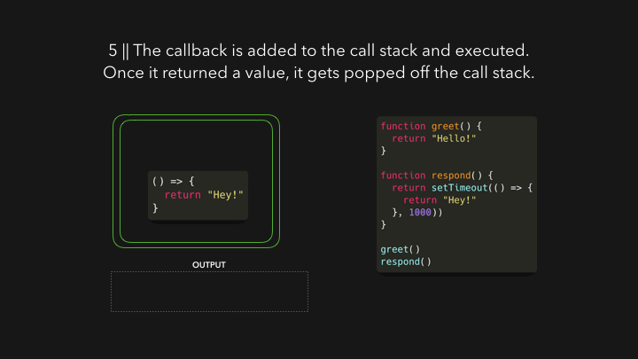

# js-visualized

## [Scope](https://dev.to/lydiahallie/javascript-visualized-scope-chain-13pd)

## [Hoisting](https://dev.to/lydiahallie/javascript-visualized-hoisting-478h)

## [Event Loop](https://dev.to/lydiahallie/javascript-visualized-event-loop-3dif)

JavaScript is **single-threaded**: only one task can run at a time. JavaScript runs on the browser's main thread by default

1.  When we invoke a function, it gets added to something called the call stack. The call stack is part of the JS engine, this isn't browser specific. It's a stack, meaning that it's first-in, last-out (think of a pile of pancakes). When a function returns a value, it gets popped off the stack
    
2.  The `respond` function returns a `setTimeout` function. The `setTimeout` function is provided to us by the Web API: it lets us delay tasks without blocking the main thread
    *   The callback function that we passed to the `setTimeout` function, the arrow function `() => { return ' Hey ' }` gets added to the Web API
    *   In the meantime, the `setTimeout` function and the respond function get popped off the stack, they both returned their values
        
3.  In the Web API, a timer runs as long as the second argument we passed to it, 1000ms. The callback doesn't immediately get added to the call stack, instead it's passed to something called the queue
    
4.  Now this's the part we've all been waiting for... Time for the event loop to do its only task: **connecting the queue with the call stack**. If the call stack is empty, so if all previously invoked functions have returned their values and have been popped off the stack, the *first item* in the queue gets added to the call stack. In this case, no other functions were invoked, meaning that the call stack was empty by the time the callback function was the first item in the queue
    
5.  The callback function is added to the call stack, gets invoked, and returns a value, and gets popped off the stack
    

