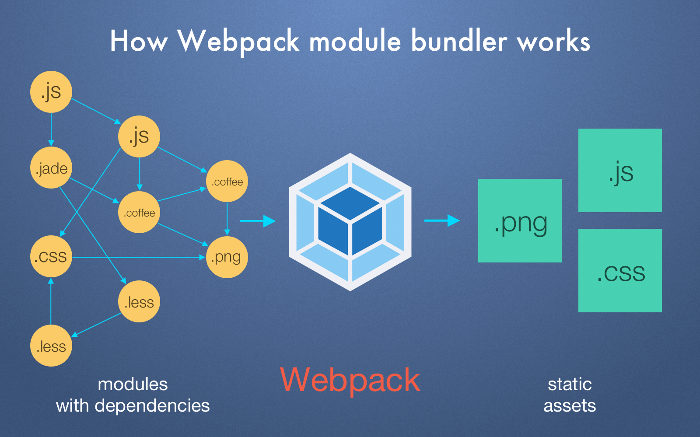

# Concepts

At its core, **webpack** is a *static module bundler* for modern javascript applications. When webpack processes your application, it internally builds a dependency graph from one or more *entry points* and then combines every module your project needs into one or more *bundles*, which are static assets to serve your content from


::: tip Dependency Grpah

*Dependency*(or *coupling*) is a state in which one object uses a function of another object

*Modules* are the bricks for structuring non-trivial applications, but also the main mechanism to enforce **information hiding** by keeping private all the functions and variables that are not explicitly marked to be **exported**

Any time one file depends on another, webpack treats this as a *dependency*. This allows webpack to take non-code assets, such as images or web fonts, and also provide them as *dependencies* for your application

A dependency graph is a graph built by connecting every module with its direct dependencies
:::

## [Module Bundler](https://slides.com/lucianomammino/unbundling-the-javascript-module-bundler-dublinjs#/76/0/3)
Module bundler is a tool that takes modules with dependencies and emits static assets representing those modules. Those static assets can be processed by browsers

A module bundler has to:
1. **Dependency Resolution** : Construct the *dependency graph*
1. **Packing** : Assemble the modules in the graph into a single executable asset


### Dependency Resolution
**Dependency Resolution** : Construct the *dependency graph*
```js
// app.js
const calculator = require('./calculator')
const log = require('./log')
log(calculator('3 + 7 * 2'))

// log.js
module.exports = console.log

// calculator.js
const parser = require('./parser')
const resolver = require('./resolver')

module.exports = (expr) => resolver(parser(expr))

// parser.js
module.exports = (expr) => { /* ... */ }

// log.js
module.exports = (expr) => { /* ... */ }
```

[Dependency Resolution](./drawio/dependency-resolution.drawio){link-type="drawio"}

During dependency resolution, the bundler creates a **modules map**

```js
{
  // ${require path}: ${module factory function}
  './app': (module, require) => { ... },
  './calculator': (module, require) => { ... },
  './parser': (module, require) => { ... },
  './resolver': (module, require) => { ... },
  './log': (module, require) => { ... },
}
```
### Packing
**Packing** : Assemble the modules in the graph into a single executable asset

[Packing](./drawio/packing.drawio){link-type="drawio"}

```js
// IIFE passing the modules map as arguments
((modulesMap) => {
  // Custom require function: it will load the modules by evaluating the code from the modules map
  const require = (name) => {
    // A reference to a module with an empty module.exports. This will be filled at evaluation time
    const module = { exports: {} };
    // Invoking the factory function for the given module name (Service locator pattern).
    // The current reference module is passed, the factory function will modify this object by adding the proper exported values
    // The custom require function is passed so, modules can recursively require other modules
    modulesMap[name](module, require);
    // The resulting module.exports is returned
    return modules.exports;
  };
  // The entrypoint module is required, triggering the actual execution of the business logic
  require('./app');
})(
  {
    './app': (module, require) => {...},
    './calculator': (module, require) => {...},
    './log': (module, require) => {...},
    './parser': (module, require) => {...},
    './resolver': (module, require) => {...},
  }
);
```

## Entry
An **entry point** indicates which module webpack should use to begin building out its internal dependency graph. Webpack will figure out which other modules and libraries that entry point depends on(directly and indirectly)

```js
// webpack.config.js
module.exports = {
  entry: './src/index.js',
};
```

## Output
The **output** property tells webpack where to emit the *bundles* it creates and how to name these files. It defaults to `./dist/main.js` for the main output file and to the `./dist` folder for any other generated file

```js
const path = require('path');

module.exports = {
  entry: './src/index.js',
  output: {
    path: path.resolve(__dirname, 'dist'),
    filename: 'demo-target-bundle.js',
  },
};
```

## Loaders
Out of the box webpack only understands JavaScript and JSON files. **Loaders** allow webpack to process other types of files and convert them into valid modules that can be consumed by your application and added to the dependency graph

Loaders are transformations that are applied to the source code of a module. They allow you to preprocess files as you `import` or load them

At a high level, **loaders** have two properties in your webpack configuration:
1. The `test` property identifies which file or files should be transformed
1. The `use` property indicates which loader should be used to do the transforming

```js
const path = require('path');

module.exports = {
  entry: './src/index.js',
  output: {
    path: path.resolve(__dirname, 'dist'),
    filename: 'demo-target-bundle.js',
  },
  module: {
    rules: [{
      test: /\.txt$/,
      use: 'raw-loader',
    }]
  },
};
```

::: warning Warning
Keep in mind that when using regex to match files, you may not quote it. i.e `/\.txt$/` is not the same as `'/\.txt$'`
:::

## Plugins
While loaders are used to transform certain types of modules, plugins can be leveraged to perform a wider range of tasks like bundle optimization, asset management and injection of environment variables

```js
const HtmlWebpackPlugin = require('html-webpack-plugin');
const webpack = require('webpack'); //to access built-in plugins

module.exports = {
  module: {
    rules: [{ test: /\.txt$/, use: 'raw-loader' }],
  },
  plugins: [new HtmlWebpackPlugin({ template: './src/index.html' })],
};
```

## Mode
By setting the `mode` parameter to either `developement`, `production` or `none`, you can enable webpack's built-in optimizations that correspond to each environment. The default value is `production`

```js
module.exports = {
  mode: 'production',
};
```